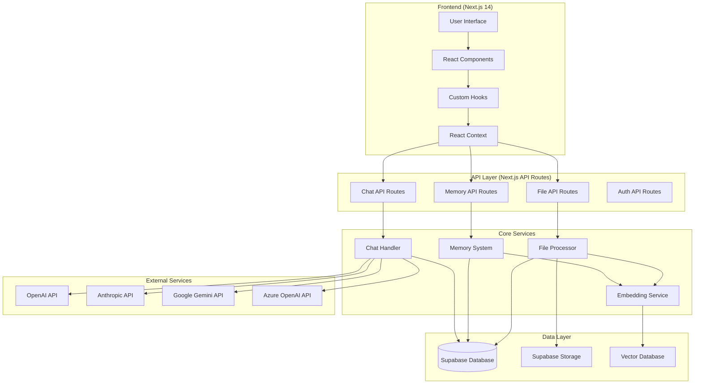
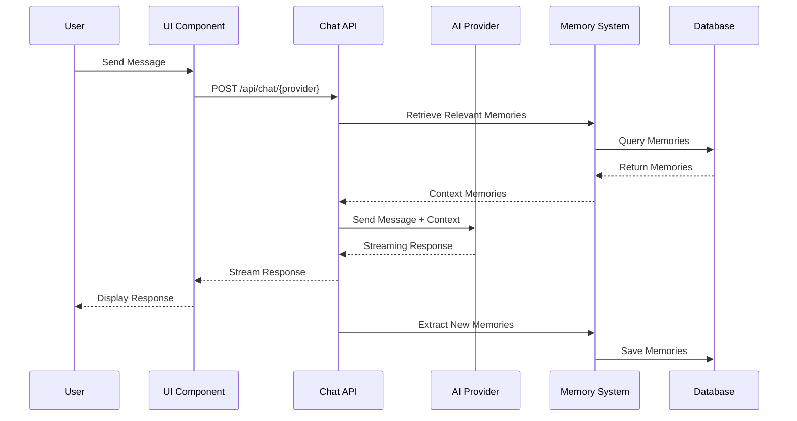
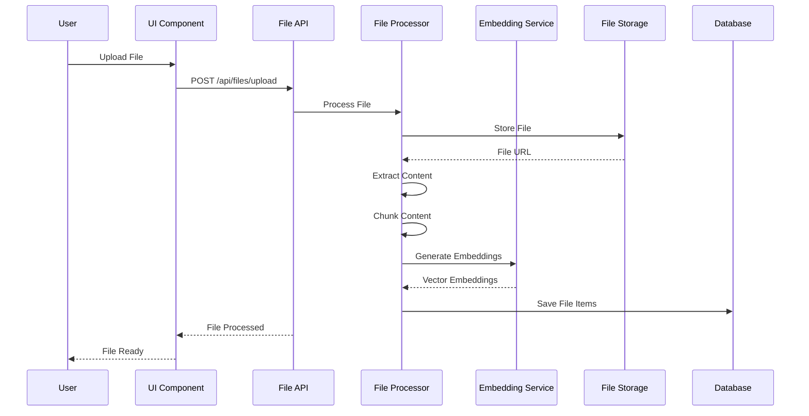
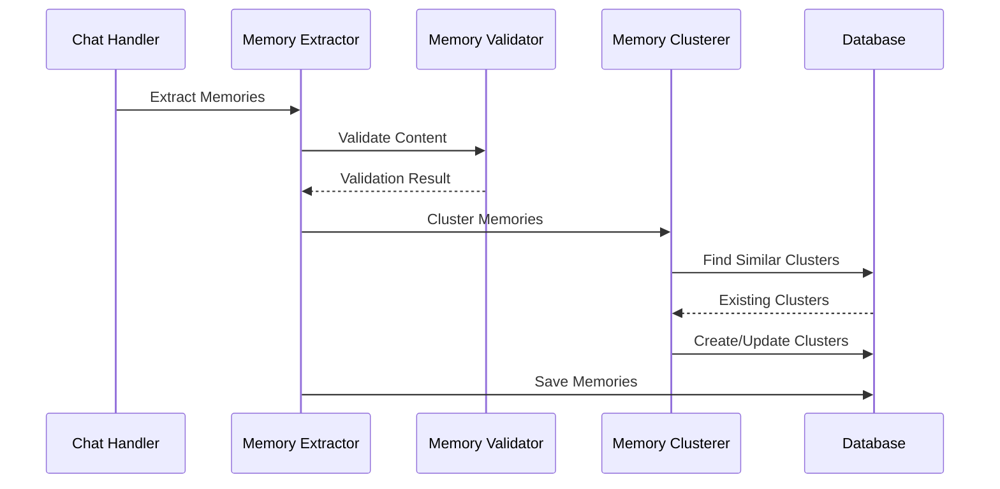

# 🏗️ Chatbot UI - System Architecture

## 📋 Table of Contents

- [Overview](#overview)
- [Technology Stack](#technology-stack)
- [System Architecture](#system-architecture)
- [Core Components](#core-components)
- [Data Flow](#data-flow)
- [Security Model](#security-model)
- [Performance Considerations](#performance-considerations)
- [Scalability](#scalability)

## 🎯 Overview

Chatbot UI is a sophisticated Next.js 14 application that provides a comprehensive AI chatbot platform with intelligent memory capabilities, multi-provider AI integration, and advanced file management features. The system is designed to be scalable, maintainable, and developer-friendly.

### Key Features

- 🤖 **Multi-Provider AI Integration**: Support for OpenAI, Anthropic, Google, Azure, and custom models
- 🧠 **Intelligent Memory System**: Advanced semantic memory with clustering and deduplication
- 📁 **File Management**: Comprehensive file upload, processing, and retrieval system
- 🔐 **Authentication**: Secure user authentication with Supabase Auth
- 🎨 **Modern UI**: Beautiful, responsive interface built with Radix UI and Tailwind CSS
- 🔧 **Developer Tools**: Built-in code editing, file reading, and Git integration

## 🛠️ Technology Stack

### Frontend
- **Framework**: Next.js 14 (App Router)
- **Language**: TypeScript
- **Styling**: Tailwind CSS
- **UI Components**: Radix UI
- **State Management**: React Context + Hooks
- **Icons**: Tabler Icons, Lucide React

### Backend
- **Runtime**: Node.js (Edge Runtime for API routes)
- **Database**: Supabase (PostgreSQL)
- **Authentication**: Supabase Auth
- **File Storage**: Supabase Storage
- **Vector Database**: PostgreSQL with pgvector extension

### AI & ML
- **AI Providers**: OpenAI, Anthropic, Google Gemini, Azure OpenAI, Mistral, Groq
- **Embeddings**: OpenAI Text Embeddings, Local embeddings with Xenova/transformers
- **Memory Processing**: Custom intelligent memory system with semantic analysis

### Development Tools
- **Package Manager**: npm
- **Linting**: ESLint
- **Formatting**: Prettier
- **Testing**: Jest, Playwright
- **Type Checking**: TypeScript
- **Database Migrations**: Supabase CLI

## 🏛️ System Architecture



## 🔧 Core Components

### 1. Memory System (`lib/memory-system.ts`)

The memory system is the heart of the application's intelligence, providing persistent context and learning capabilities.

**Key Responsibilities:**
- Semantic memory extraction and storage
- Intelligent clustering and deduplication
- Relevance scoring and decay
- Memory retrieval and context injection

**Architecture:**
```typescript
// Core memory system components
export class MemorySystem {
  // Memory extraction and processing
  async extractMemories(conversation: Message[]): Promise<Memory[]>
  
  // Semantic clustering
  async clusterMemories(memories: Memory[]): Promise<MemoryCluster[]>
  
  // Relevance scoring
  async calculateRelevance(memory: Memory, context: string): Promise<number>
  
  // Memory retrieval
  async retrieveRelevantMemories(context: string, limit: number): Promise<Memory[]>
}
```

### 2. Chat Handler (`components/chat/chat-hooks/use-chat-handler.tsx`)

Manages the chat interface and coordinates between different AI providers.

**Key Responsibilities:**
- Message handling and streaming
- Multi-provider AI integration
- File attachment processing
- Memory integration

**Architecture:**
```typescript
// Chat handler hook
export const useChatHandler = () => {
  // Message processing
  const handleSendMessage = async (message: string, files?: File[])
  
  // AI provider selection
  const selectProvider = (provider: AIProvider)
  
  // Streaming response handling
  const handleStreamingResponse = (stream: ReadableStream)
  
  // Memory integration
  const integrateMemory = (memories: Memory[])
}
```

### 3. File Management System (`lib/retrieval/`)

Handles file upload, processing, and retrieval with intelligent chunking and embedding.

**Key Responsibilities:**
- File upload and validation
- Content extraction and chunking
- Embedding generation
- Semantic search and retrieval

**Supported Formats:**
- PDF documents
- Word documents (.docx)
- Text files
- CSV files
- Images (with OCR)

### 4. Authentication System (`lib/supabase/`)

Secure user authentication and authorization using Supabase Auth.

**Key Features:**
- Email/password authentication
- OAuth providers (Google, GitHub)
- Row Level Security (RLS)
- Session management

## 🔄 Data Flow

### 1. Chat Message Flow



### 2. File Processing Flow



### 3. Memory System Flow



## 🔐 Security Model

### 1. Authentication & Authorization

**Supabase Auth Integration:**
- JWT-based authentication
- Secure session management
- Automatic token refresh
- Multi-provider OAuth support

**Row Level Security (RLS):**
```sql
-- Example RLS policy for memories
CREATE POLICY "Users can only access their own memories"
ON memories
FOR ALL
USING (user_id = auth.uid());
```

### 2. API Security

**Authentication Requirements:**
- All API routes require valid session
- User context validation
- Rate limiting on sensitive endpoints
- Input validation and sanitization

**Security Headers:**
```typescript
// Security headers configuration
const securityHeaders = {
  'X-Frame-Options': 'DENY',
  'X-Content-Type-Options': 'nosniff',
  'Referrer-Policy': 'strict-origin-when-cross-origin',
  'Content-Security-Policy': "default-src 'self'"
}
```

### 3. File Security

**Upload Validation:**
- File type validation
- Size limits enforcement
- Malware scanning (optional)
- Secure file storage with access controls

**Access Control:**
- User-specific file storage paths
- Private file access by default
- Optional public sharing with permissions

## ⚡ Performance Considerations

### 1. Frontend Performance

**Optimization Strategies:**
- React.memo for expensive components
- Lazy loading for large components
- Virtual scrolling for long lists
- Image optimization with Next.js

**Bundle Optimization:**
- Tree shaking for unused code
- Dynamic imports for large libraries
- Code splitting by routes
- Compression and caching

### 2. Backend Performance

**API Optimization:**
- Edge runtime for API routes
- Streaming responses for chat
- Database query optimization
- Caching strategies

**Database Performance:**
- Proper indexing on frequently queried columns
- Vector similarity search optimization
- Connection pooling
- Query result caching

### 3. Memory System Performance

**Optimization Techniques:**
- Batch processing for memory operations
- Background memory processing
- Intelligent memory pruning
- Caching of frequently accessed memories

## 📈 Scalability

### 1. Horizontal Scaling

**Stateless Design:**
- API routes are stateless
- Session data stored in database
- File storage in cloud storage
- No server-side state dependencies

**Load Balancing:**
- Multiple API instances
- Database connection pooling
- CDN for static assets
- Global edge deployment

### 2. Database Scaling

**PostgreSQL Optimization:**
- Read replicas for query distribution
- Partitioning for large tables
- Connection pooling
- Query optimization

**Vector Database Scaling:**
- Efficient vector similarity search
- Index optimization for embeddings
- Memory clustering for performance
- Background processing for heavy operations

### 3. File Storage Scaling

**Supabase Storage:**
- Automatic CDN distribution
- Efficient file chunking
- Background processing
- Scalable storage limits

## 🔧 Development Architecture

### 1. Code Organization

```
chatbot-ui/
├── app/                    # Next.js App Router
│   ├── api/               # API routes
│   ├── [locale]/          # Localized pages
│   └── globals.css        # Global styles
├── components/            # React components
│   ├── ui/               # Base UI components
│   ├── chat/             # Chat-specific components
│   └── sidebar/          # Sidebar components
├── lib/                  # Utility libraries
│   ├── memory-system.ts  # Memory system
│   ├── supabase/         # Database client
│   └── utils.ts          # Utility functions
├── db/                   # Database operations
├── types/                # TypeScript types
└── supabase/             # Database migrations
```

### 2. State Management

**React Context Pattern:**
```typescript
// Global state management
export const ChatbotUIContext = createContext({
  // User state
  profile: null,
  workspaces: [],
  
  // Chat state
  chatMessages: [],
  selectedChat: null,
  
  // UI state
  sidebarOpen: false,
  theme: 'dark'
})
```

### 3. Error Handling

**Comprehensive Error Handling:**
- API error responses with proper status codes
- User-friendly error messages
- Error boundaries for React components
- Logging and monitoring integration

---

**Last Updated**: December 2024  
**Version**: 2.0.0  
**Status**: Production Ready 