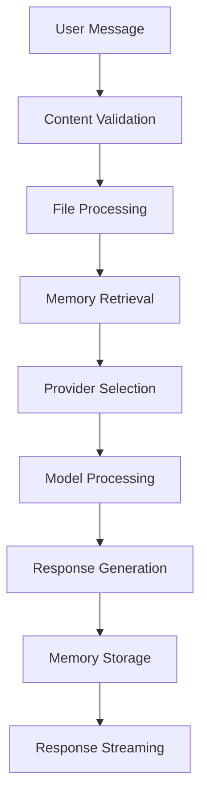

# Chat API Documentation

## Table of Contents

1. [Overview](#overview)
2. [API Endpoints](#api-endpoints)
3. [Multi-Provider Integration](#multi-provider-integration)
4. [Message Handling](#message-handling)
5. [Streaming Responses](#streaming-responses)
6. [File Attachments](#file-attachments)
7. [Memory Integration](#memory-integration)
8. [Tool and Function Calling](#tool-and-function-calling)
9. [Error Handling](#error-handling)
10. [Rate Limiting](#rate-limiting)
11. [Authentication](#authentication)
12. [Examples](#examples)

## Overview

The Chat API provides a unified interface for interacting with multiple AI providers including OpenAI, Anthropic, Google, and Azure. It supports streaming responses, file attachments, memory integration, and advanced features like tool calling and function execution.

### Supported Providers

- **OpenAI**: GPT-4, GPT-3.5-turbo, GPT-4-turbo
- **Anthropic**: Claude-3, Claude-2.1, Claude-instant
- **Google**: Gemini Pro, Gemini Flash
- **Azure**: Azure OpenAI services
- **Mistral**: Mistral AI models

### Key Features

- **Multi-Provider Support**: Seamless switching between AI providers
- **Streaming Responses**: Real-time message streaming
- **File Processing**: Support for PDF, DOCX, TXT, and image files
- **Memory Integration**: Intelligent conversation memory
- **Tool Calling**: Function execution and tool usage
- **Error Handling**: Comprehensive error management
- **Rate Limiting**: Provider-specific rate limiting
- **Authentication**: Secure API access

## API Endpoints

### Base URL

```
Production: https://your-domain.com/api/chat
Development: http://localhost:3000/api/chat
```

### Endpoint Structure

```
/api/chat/
├── openai/          # OpenAI provider
├── anthropic/       # Anthropic provider
├── google/          # Google provider
├── azure/           # Azure provider
├── mistral/         # Mistral provider
├── stream/          # Streaming endpoint
├── files/           # File processing
└── tools/           # Tool execution
```

## Multi-Provider Integration

### Provider Configuration

```typescript
// lib/providers/config.ts
export const PROVIDER_CONFIG = {
  openai: {
    apiKey: process.env.OPENAI_API_KEY,
    baseURL: 'https://api.openai.com/v1',
    models: ['gpt-4', 'gpt-3.5-turbo', 'gpt-4-turbo'],
    maxTokens: 4096,
    temperature: 0.7
  },
  anthropic: {
    apiKey: process.env.ANTHROPIC_API_KEY,
    baseURL: 'https://api.anthropic.com',
    models: ['claude-3-opus', 'claude-3-sonnet', 'claude-3-haiku'],
    maxTokens: 4096,
    temperature: 0.7
  },
  google: {
    apiKey: process.env.GOOGLE_API_KEY,
    baseURL: 'https://generativelanguage.googleapis.com',
    models: ['gemini-pro', 'gemini-flash'],
    maxTokens: 8192,
    temperature: 0.7
  }
}
```

### Provider Selection

```typescript
// lib/providers/provider-factory.ts
export class ProviderFactory {
  static createProvider(provider: string): ChatProvider {
    switch (provider) {
      case 'openai':
        return new OpenAIProvider()
      case 'anthropic':
        return new AnthropicProvider()
      case 'google':
        return new GoogleProvider()
      case 'azure':
        return new AzureProvider()
      case 'mistral':
        return new MistralProvider()
      default:
        throw new Error(`Unsupported provider: ${provider}`)
    }
  }
}
```

## Message Handling

### Message Structure

```typescript
interface ChatMessage {
  id: string
  role: 'user' | 'assistant' | 'system'
  content: string
  model?: string
  timestamp: string
  tokens?: number
  metadata?: {
    files?: FileAttachment[]
    tools?: ToolCall[]
    memory?: MemoryReference[]
  }
}

interface FileAttachment {
  id: string
  name: string
  type: string
  size: number
  url: string
  content?: string
}

interface ToolCall {
  id: string
  type: string
  name: string
  arguments: Record<string, any>
  result?: any
}
```

### Message Processing Pipeline



### Message Validation

```typescript
// lib/chat/message-validation.ts
import { z } from 'zod'

export const messageSchema = z.object({
  content: z.string().min(1).max(10000),
  model: z.string().optional(),
  temperature: z.number().min(0).max(2).optional(),
  maxTokens: z.number().min(1).max(8192).optional(),
  files: z.array(fileSchema).optional(),
  tools: z.array(toolSchema).optional(),
  memory: z.boolean().optional()
})

export const validateMessage = (message: any): ChatMessage => {
  return messageSchema.parse(message)
}
```

## Streaming Responses

### Server-Sent Events (SSE)

```typescript
// app/api/chat/stream/route.ts
import { NextRequest, NextResponse } from 'next/server'

export async function POST(request: NextRequest) {
  const encoder = new TextEncoder()
  
  const stream = new ReadableStream({
    async start(controller) {
      try {
        const { messages, provider, model } = await request.json()
        
        const chatProvider = ProviderFactory.createProvider(provider)
        
        await chatProvider.streamChat(messages, {
          model,
          onChunk: (chunk: string) => {
            controller.enqueue(encoder.encode(`data: ${JSON.stringify({ content: chunk })}\n\n`))
          },
          onComplete: () => {
            controller.enqueue(encoder.encode('data: [DONE]\n\n'))
            controller.close()
          },
          onError: (error: Error) => {
            controller.enqueue(encoder.encode(`data: ${JSON.stringify({ error: error.message })}\n\n`))
            controller.close()
          }
        })
      } catch (error) {
        controller.error(error)
      }
    }
  })

  return new Response(stream, {
    headers: {
      'Content-Type': 'text/plain; charset=utf-8',
      'Cache-Control': 'no-cache',
      'Connection': 'keep-alive',
    }
  })
}
```

### Client-Side Streaming

```typescript
// lib/chat/streaming-client.ts
export class StreamingChatClient {
  async streamChat(messages: ChatMessage[], options: StreamOptions): Promise<void> {
    const response = await fetch('/api/chat/stream', {
      method: 'POST',
      headers: { 'Content-Type': 'application/json' },
      body: JSON.stringify({ messages, ...options })
    })

    const reader = response.body?.getReader()
    const decoder = new TextDecoder()

    while (reader) {
      const { done, value } = await reader.read()
      if (done) break

      const chunk = decoder.decode(value)
      const lines = chunk.split('\n')

      for (const line of lines) {
        if (line.startsWith('data: ')) {
          const data = line.slice(6)
          if (data === '[DONE]') {
            options.onComplete?.()
            return
          }

          try {
            const parsed = JSON.parse(data)
            if (parsed.error) {
              options.onError?.(new Error(parsed.error))
              return
            }
            options.onChunk?.(parsed.content)
          } catch (error) {
            console.error('Error parsing stream data:', error)
          }
        }
      }
    }
  }
}
```

## File Attachments

### Supported File Types

- **Documents**: PDF, DOCX, TXT, RTF
- **Images**: JPG, PNG, GIF, WebP
- **Code**: JS, TS, PY, JAVA, CPP, etc.
- **Data**: CSV, JSON, XML

### File Processing Pipeline

```typescript
// lib/chat/file-processor.ts
export class FileProcessor {
  async processFile(file: File): Promise<ProcessedFile> {
    const fileType = this.getFileType(file.name)
    
    switch (fileType) {
      case 'pdf':
        return await this.processPDF(file)
      case 'docx':
        return await this.processDOCX(file)
      case 'image':
        return await this.processImage(file)
      case 'text':
        return await this.processText(file)
      default:
        throw new Error(`Unsupported file type: ${fileType}`)
    }
  }

  private async processPDF(file: File): Promise<ProcessedFile> {
    const pdf = await import('pdf-parse')
    const buffer = await file.arrayBuffer()
    const data = await pdf.default(Buffer.from(buffer))
    
    return {
      content: data.text,
      metadata: {
        pages: data.numpages,
        info: data.info
      }
    }
  }

  private async processDOCX(file: File): Promise<ProcessedFile> {
    const mammoth = await import('mammoth')
    const buffer = await file.arrayBuffer()
    const result = await mammoth.extractRawText({ buffer: Buffer.from(buffer) })
    
    return {
      content: result.value,
      metadata: result.messages
    }
  }

  private async processImage(file: File): Promise<ProcessedFile> {
    // Use OpenAI Vision API or similar for image processing
    const formData = new FormData()
    formData.append('image', file)
    
    const response = await fetch('/api/chat/vision', {
      method: 'POST',
      body: formData
    })
    
    const result = await response.json()
    return {
      content: result.description,
      metadata: { vision: true }
    }
  }
}
```

### File Upload Endpoint

```typescript
// app/api/chat/files/route.ts
export async function POST(request: NextRequest) {
  try {
    const formData = await request.formData()
    const files = formData.getAll('files') as File[]
    
    const processor = new FileProcessor()
    const processedFiles: ProcessedFile[] = []
    
    for (const file of files) {
      const processed = await processor.processFile(file)
      processedFiles.push(processed)
    }
    
    return NextResponse.json({ files: processedFiles })
  } catch (error) {
    return NextResponse.json(
      { error: 'File processing failed' },
      { status: 500 }
    )
  }
}
```

## Memory Integration

### Memory Retrieval

```typescript
// lib/chat/memory-integration.ts
export class MemoryIntegration {
  async getRelevantMemories(context: string, userId: string): Promise<Memory[]> {
    const supabase = createClient()
    
    return await getRelevantMemories(
      supabase,
      userId,
      context,
      5, // limit
      0.6 // similarity threshold
    )
  }

  async saveMemory(content: string, userId: string): Promise<Memory> {
    const supabase = createClient()
    
    return await saveEnhancedMemory(supabase, content, userId)
  }

  async enhanceContext(messages: ChatMessage[], userId: string): Promise<ChatMessage[]> {
    const lastMessage = messages[messages.length - 1]
    const relevantMemories = await this.getRelevantMemories(lastMessage.content, userId)
    
    if (relevantMemories.length > 0) {
      const memoryContext = relevantMemories
        .map(memory => `[Memory: ${memory.content}]`)
        .join('\n')
      
      const enhancedMessage = {
        ...lastMessage,
        content: `${memoryContext}\n\n${lastMessage.content}`
      }
      
      return [...messages.slice(0, -1), enhancedMessage]
    }
    
    return messages
  }
}
```

### Memory-Aware Chat

```typescript
// lib/chat/memory-chat.ts
export class MemoryChatProvider extends BaseChatProvider {
  private memoryIntegration = new MemoryIntegration()

  async chat(messages: ChatMessage[], options: ChatOptions): Promise<ChatResponse> {
    // Enhance context with relevant memories
    const enhancedMessages = await this.memoryIntegration.enhanceContext(
      messages,
      options.userId
    )
    
    // Process chat with enhanced context
    const response = await super.chat(enhancedMessages, options)
    
    // Save user message to memory
    const lastUserMessage = messages.find(m => m.role === 'user')
    if (lastUserMessage) {
      await this.memoryIntegration.saveMemory(
        lastUserMessage.content,
        options.userId
      )
    }
    
    return response
  }
}
```

## Tool and Function Calling

### Tool Definition

```typescript
// lib/tools/tool-definitions.ts
export interface Tool {
  name: string
  description: string
  parameters: {
    type: 'object'
    properties: Record<string, any>
    required: string[]
  }
  execute: (args: any) => Promise<any>
}

export const AVAILABLE_TOOLS: Tool[] = [
  {
    name: 'search_web',
    description: 'Search the web for current information',
    parameters: {
      type: 'object',
      properties: {
        query: {
          type: 'string',
          description: 'Search query'
        }
      },
      required: ['query']
    },
    execute: async (args) => {
      // Implement web search
      return await searchWeb(args.query)
    }
  },
  {
    name: 'get_weather',
    description: 'Get current weather information',
    parameters: {
      type: 'object',
      properties: {
        location: {
          type: 'string',
          description: 'City or location'
        }
      },
      required: ['location']
    },
    execute: async (args) => {
      return await getWeather(args.location)
    }
  }
]
```

### Tool Execution

```typescript
// lib/chat/tool-execution.ts
export class ToolExecutor {
  async executeTool(toolCall: ToolCall): Promise<any> {
    const tool = AVAILABLE_TOOLS.find(t => t.name === toolCall.name)
    
    if (!tool) {
      throw new Error(`Tool not found: ${toolCall.name}`)
    }
    
    try {
      const result = await tool.execute(toolCall.arguments)
      return {
        toolCallId: toolCall.id,
        result,
        success: true
      }
    } catch (error) {
      return {
        toolCallId: toolCall.id,
        error: error.message,
        success: false
      }
    }
  }

  async processToolCalls(toolCalls: ToolCall[]): Promise<ToolResult[]> {
    const results: ToolResult[] = []
    
    for (const toolCall of toolCalls) {
      const result = await this.executeTool(toolCall)
      results.push(result)
    }
    
    return results
  }
}
```

### Function Calling Integration

```typescript
// lib/providers/openai-provider.ts
export class OpenAIProvider implements ChatProvider {
  async chat(messages: ChatMessage[], options: ChatOptions): Promise<ChatResponse> {
    const openai = new OpenAI({
      apiKey: process.env.OPENAI_API_KEY
    })

    const tools = options.tools?.map(tool => ({
      type: 'function' as const,
      function: {
        name: tool.name,
        description: tool.description,
        parameters: tool.parameters
      }
    })) || []

    const response = await openai.chat.completions.create({
      model: options.model || 'gpt-4',
      messages: this.formatMessages(messages),
      tools,
      tool_choice: tools.length > 0 ? 'auto' : undefined,
      stream: options.stream || false
    })

    return this.formatResponse(response)
  }
}
```

## Error Handling

### Error Types

```typescript
// lib/chat/errors.ts
export class ChatError extends Error {
  constructor(
    message: string,
    public code: string,
    public statusCode: number = 500,
    public details?: any
  ) {
    super(message)
    this.name = 'ChatError'
  }
}

export class ProviderError extends ChatError {
  constructor(provider: string, message: string, details?: any) {
    super(`Provider ${provider} error: ${message}`, 'PROVIDER_ERROR', 502, details)
    this.name = 'ProviderError'
  }
}

export class RateLimitError extends ChatError {
  constructor(provider: string, retryAfter?: number) {
    super(`Rate limit exceeded for ${provider}`, 'RATE_LIMIT', 429)
    this.name = 'RateLimitError'
    this.details = { retryAfter }
  }
}

export class ValidationError extends ChatError {
  constructor(message: string, details?: any) {
    super(`Validation error: ${message}`, 'VALIDATION_ERROR', 400, details)
    this.name = 'ValidationError'
  }
}
```

### Error Handling Middleware

```typescript
// lib/chat/error-handler.ts
export function handleChatError(error: Error): NextResponse {
  if (error instanceof ChatError) {
    return NextResponse.json(
      {
        error: error.message,
        code: error.code,
        details: error.details
      },
      { status: error.statusCode }
    )
  }

  if (error instanceof ProviderError) {
    return NextResponse.json(
      {
        error: error.message,
        code: error.code,
        provider: error.details?.provider
      },
      { status: error.statusCode }
    )
  }

  // Log unexpected errors
  console.error('Unexpected chat error:', error)
  
  return NextResponse.json(
    {
      error: 'Internal server error',
      code: 'INTERNAL_ERROR'
    },
    { status: 500 }
  )
}
```

### Retry Logic

```typescript
// lib/chat/retry-handler.ts
export class RetryHandler {
  async withRetry<T>(
    operation: () => Promise<T>,
    maxRetries: number = 3,
    delay: number = 1000
  ): Promise<T> {
    let lastError: Error

    for (let attempt = 1; attempt <= maxRetries; attempt++) {
      try {
        return await operation()
      } catch (error) {
        lastError = error as Error
        
        if (error instanceof RateLimitError) {
          const retryAfter = error.details?.retryAfter || delay * attempt
          await this.sleep(retryAfter)
          continue
        }

        if (error instanceof ProviderError && attempt < maxRetries) {
          await this.sleep(delay * attempt)
          continue
        }

        throw error
      }
    }

    throw lastError!
  }

  private sleep(ms: number): Promise<void> {
    return new Promise(resolve => setTimeout(resolve, ms))
  }
}
```

## Rate Limiting

### Provider-Specific Rate Limits

```typescript
// lib/chat/rate-limiter.ts
export class RateLimiter {
  private limits = new Map<string, RateLimit>()

  constructor() {
    // Initialize rate limits for each provider
    this.limits.set('openai', { requests: 3500, window: 60 * 1000 }) // 3500 requests per minute
    this.limits.set('anthropic', { requests: 100, window: 60 * 1000 }) // 100 requests per minute
    this.limits.set('google', { requests: 1500, window: 60 * 1000 }) // 1500 requests per minute
  }

  async checkRateLimit(provider: string, userId: string): Promise<boolean> {
    const limit = this.limits.get(provider)
    if (!limit) return true

    const key = `${provider}:${userId}`
    const now = Date.now()
    
    // Get current usage
    const usage = await this.getUsage(key)
    
    // Clean old entries
    const validRequests = usage.filter(timestamp => now - timestamp < limit.window)
    
    if (validRequests.length >= limit.requests) {
      return false
    }

    // Add current request
    validRequests.push(now)
    await this.setUsage(key, validRequests)
    
    return true
  }

  private async getUsage(key: string): Promise<number[]> {
    // Implement with Redis or similar
    return []
  }

  private async setUsage(key: string, usage: number[]): Promise<void> {
    // Implement with Redis or similar
  }
}
```

### Rate Limit Middleware

```typescript
// middleware.ts
import { NextRequest, NextResponse } from 'next/server'
import { RateLimiter } from '@/lib/chat/rate-limiter'

const rateLimiter = new RateLimiter()

export async function middleware(request: NextRequest) {
  if (request.nextUrl.pathname.startsWith('/api/chat/')) {
    const userId = getUserId(request)
    const provider = getProvider(request)
    
    const allowed = await rateLimiter.checkRateLimit(provider, userId)
    
    if (!allowed) {
      return NextResponse.json(
        { error: 'Rate limit exceeded' },
        { status: 429, headers: { 'Retry-After': '60' } }
      )
    }
  }
  
  return NextResponse.next()
}
```

## Authentication

### API Key Authentication

```typescript
// lib/auth/api-auth.ts
export function validateApiKey(request: NextRequest): string | null {
  const authHeader = request.headers.get('authorization')
  
  if (!authHeader || !authHeader.startsWith('Bearer ')) {
    return null
  }
  
  const apiKey = authHeader.slice(7)
  
  // Validate API key format
  if (!isValidApiKey(apiKey)) {
    return null
  }
  
  return apiKey
}

export function getUserFromApiKey(apiKey: string): Promise<User | null> {
  // Implement API key to user mapping
  return Promise.resolve(null)
}
```

### Session Authentication

```typescript
// lib/auth/session-auth.ts
export async function getSessionUser(request: NextRequest): Promise<User | null> {
  const supabase = createClient()
  
  const { data: { session } } = await supabase.auth.getSession()
  
  if (!session) {
    return null
  }
  
  return {
    id: session.user.id,
    email: session.user.email,
    name: session.user.user_metadata?.name
  }
}
```

## Examples

### Basic Chat Request

```typescript
// Example: Basic chat request
const response = await fetch('/api/chat/openai', {
  method: 'POST',
  headers: {
    'Content-Type': 'application/json',
    'Authorization': 'Bearer your-api-key'
  },
  body: JSON.stringify({
    messages: [
      { role: 'user', content: 'Hello, how are you?' }
    ],
    model: 'gpt-4',
    temperature: 0.7,
    maxTokens: 1000
  })
})

const result = await response.json()
console.log(result.content)
```

### Streaming Chat

```typescript
// Example: Streaming chat
const client = new StreamingChatClient()

await client.streamChat(
  [{ role: 'user', content: 'Tell me a story' }],
  {
    provider: 'openai',
    model: 'gpt-4',
    onChunk: (chunk) => {
      console.log('Received chunk:', chunk)
      // Update UI with streaming content
    },
    onComplete: () => {
      console.log('Stream completed')
    },
    onError: (error) => {
      console.error('Stream error:', error)
    }
  }
)
```

### File Upload and Processing

```typescript
// Example: File upload and chat
const fileInput = document.getElementById('file-input') as HTMLInputElement
const file = fileInput.files[0]

// Upload and process file
const formData = new FormData()
formData.append('files', file)

const uploadResponse = await fetch('/api/chat/files', {
  method: 'POST',
  body: formData
})

const { files } = await uploadResponse.json()

// Chat with file content
const chatResponse = await fetch('/api/chat/openai', {
  method: 'POST',
  headers: { 'Content-Type': 'application/json' },
  body: JSON.stringify({
    messages: [
      {
        role: 'user',
        content: 'Analyze this document',
        files: files
      }
    ],
    model: 'gpt-4'
  })
})
```

### Tool Calling

```typescript
// Example: Tool calling
const response = await fetch('/api/chat/openai', {
  method: 'POST',
  headers: { 'Content-Type': 'application/json' },
  body: JSON.stringify({
    messages: [
      { role: 'user', content: 'What\'s the weather in New York?' }
    ],
    model: 'gpt-4',
    tools: ['get_weather'],
    toolChoice: 'auto'
  })
})

const result = await response.json()
console.log('Tool calls:', result.toolCalls)
console.log('Tool results:', result.toolResults)
```

### Memory-Enhanced Chat

```typescript
// Example: Memory-enhanced chat
const response = await fetch('/api/chat/openai', {
  method: 'POST',
  headers: { 'Content-Type': 'application/json' },
  body: JSON.stringify({
    messages: [
      { role: 'user', content: 'What did we talk about earlier?' }
    ],
    model: 'gpt-4',
    memory: true,
    userId: 'user-123'
  })
})

const result = await response.json()
console.log('Response with memory context:', result.content)
```

---

**Last Updated**: December 2024  
**Version**: 2.0.0  
**Status**: Complete 