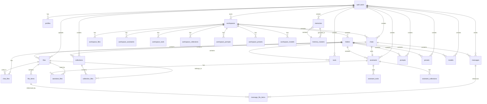

# 🗄️ Database Schema Documentation

## 📋 Table of Contents

- [Overview](#overview)
- [Entity Relationship Diagram](#entity-relationship-diagram)
- [Core Tables](#core-tables)
- [Authentication & Users](#authentication--users)
- [Workspace Management](#workspace-management)
- [Chat & Messaging](#chat--messaging)
- [File Management](#file-management)
- [Memory System](#memory-system)
- [AI & Models](#ai--models)
- [Indexes & Performance](#indexes--performance)
- [Row Level Security](#row-level-security)
- [Migrations & Versioning](#migrations--versioning)

## 🎯 Overview

The Chatbot UI database is built on Supabase (PostgreSQL) with advanced features including vector similarity search, row-level security, and comprehensive audit trails. The schema is designed to support multi-tenant architecture with secure data isolation.

### Key Features

- 🔐 **Row Level Security (RLS)**: Complete data isolation between users
- 🧠 **Vector Database**: pgvector extension for semantic search
- 📊 **Audit Trails**: Comprehensive created_at/updated_at tracking
- 🔗 **Flexible Relationships**: Many-to-many relationships with junction tables
- 📈 **Performance Optimized**: Strategic indexing and query optimization

## 🏗️ Entity Relationship Diagram



## 👥 Authentication & Users

### `auth.users` (Supabase Auth)

The core user table managed by Supabase Auth.

```sql
-- Managed by Supabase Auth
CREATE TABLE auth.users (
    id UUID PRIMARY KEY DEFAULT uuid_generate_v4(),
    email TEXT UNIQUE NOT NULL,
    encrypted_password TEXT,
    email_confirmed_at TIMESTAMPTZ,
    created_at TIMESTAMPTZ DEFAULT CURRENT_TIMESTAMP,
    updated_at TIMESTAMPTZ DEFAULT CURRENT_TIMESTAMP
);
```

### `profiles`

Extended user profile information.

```sql
CREATE TABLE profiles (
    id UUID PRIMARY KEY DEFAULT uuid_generate_v4(),
    user_id UUID NOT NULL UNIQUE REFERENCES auth.users(id) ON DELETE CASCADE,
    
    -- Profile Information
    display_name TEXT NOT NULL CHECK (char_length(display_name) <= 100),
    username TEXT NOT NULL UNIQUE CHECK (char_length(username) >= 3 AND char_length(username) <= 25),
    bio TEXT NOT NULL CHECK (char_length(bio) <= 500),
    profile_context TEXT NOT NULL CHECK (char_length(profile_context) <= 1500),
    
    -- Profile Image
    image_url TEXT NOT NULL CHECK (char_length(image_url) <= 1000),
    image_path TEXT NOT NULL CHECK (char_length(image_path) <= 1000),
    
    -- Onboarding
    has_onboarded BOOLEAN NOT NULL DEFAULT FALSE,
    
    -- AI Provider API Keys
    openai_api_key TEXT CHECK (char_length(openai_api_key) <= 1000),
    openai_organization_id TEXT CHECK (char_length(openai_organization_id) <= 1000),
    anthropic_api_key TEXT CHECK (char_length(anthropic_api_key) <= 1000),
    google_gemini_api_key TEXT CHECK (char_length(google_gemini_api_key) <= 1000),
    azure_openai_api_key TEXT CHECK (char_length(azure_openai_api_key) <= 1000),
    azure_openai_endpoint TEXT CHECK (char_length(azure_openai_endpoint) <= 1000),
    azure_openai_35_turbo_id TEXT CHECK (char_length(azure_openai_35_turbo_id) <= 1000),
    azure_openai_45_turbo_id TEXT CHECK (char_length(azure_openai_45_turbo_id) <= 1000),
    azure_openai_45_vision_id TEXT CHECK (char_length(azure_openai_45_vision_id) <= 1000),
    mistral_api_key TEXT CHECK (char_length(mistral_api_key) <= 1000),
    groq_api_key TEXT CHECK (char_length(groq_api_key) <= 1000),
    perplexity_api_key TEXT CHECK (char_length(perplexity_api_key) <= 1000),
    openrouter_api_key TEXT CHECK (char_length(openrouter_api_key) <= 1000),
    
    -- Settings
    use_azure_openai BOOLEAN NOT NULL DEFAULT FALSE,
    
    -- Metadata
    created_at TIMESTAMPTZ NOT NULL DEFAULT CURRENT_TIMESTAMP,
    updated_at TIMESTAMPTZ DEFAULT CURRENT_TIMESTAMP
);
```

**Key Features:**
- Unique username constraint with length validation
- Comprehensive API key storage for multiple providers
- Profile context for AI personalization
- Onboarding status tracking

## 🏢 Workspace Management

### `workspaces`

User workspaces for organizing content and conversations.

```sql
CREATE TABLE workspaces (
    id UUID PRIMARY KEY DEFAULT uuid_generate_v4(),
    user_id UUID NOT NULL REFERENCES auth.users(id) ON DELETE CASCADE,
    
    -- Workspace Information
    name TEXT NOT NULL CHECK (char_length(name) <= 100),
    description TEXT NOT NULL CHECK (char_length(description) <= 500),
    instructions TEXT NOT NULL CHECK (char_length(instructions) <= 1500),
    
    -- Default Settings
    default_context_length INTEGER NOT NULL,
    default_model TEXT NOT NULL CHECK (char_length(default_model) <= 1000),
    default_prompt TEXT NOT NULL CHECK (char_length(default_prompt) <= 100000),
    default_temperature REAL NOT NULL,
    embeddings_provider TEXT NOT NULL CHECK (char_length(embeddings_provider) <= 1000),
    
    -- Context Settings
    include_profile_context BOOLEAN NOT NULL,
    include_workspace_instructions BOOLEAN NOT NULL,
    
    -- Special Flags
    is_home BOOLEAN NOT NULL DEFAULT FALSE,
    
    -- Sharing
    sharing TEXT NOT NULL DEFAULT 'private',
    
    -- Metadata
    created_at TIMESTAMPTZ NOT NULL DEFAULT CURRENT_TIMESTAMP,
    updated_at TIMESTAMPTZ DEFAULT CURRENT_TIMESTAMP
);
```

**Key Features:**
- Home workspace designation with constraint protection
- Default AI settings for new chats
- Context inclusion controls
- Sharing permissions

### `folders`

Organizational structure for workspace content.

```sql
CREATE TABLE folders (
    id UUID PRIMARY KEY DEFAULT uuid_generate_v4(),
    user_id UUID NOT NULL REFERENCES auth.users(id) ON DELETE CASCADE,
    workspace_id UUID NOT NULL REFERENCES workspaces(id) ON DELETE CASCADE,
    
    -- Folder Information
    name TEXT NOT NULL,
    description TEXT NOT NULL,
    type TEXT NOT NULL,
    
    -- Metadata
    created_at TIMESTAMPTZ NOT NULL DEFAULT CURRENT_TIMESTAMP,
    updated_at TIMESTAMPTZ DEFAULT CURRENT_TIMESTAMP
);
```

## 💬 Chat & Messaging

### `chats`

Chat conversations with AI assistants.

```sql
CREATE TABLE chats (
    id UUID PRIMARY KEY DEFAULT uuid_generate_v4(),
    user_id UUID NOT NULL REFERENCES auth.users(id) ON DELETE CASCADE,
    workspace_id UUID NOT NULL REFERENCES workspaces(id) ON DELETE CASCADE,
    
    -- Optional Relationships
    assistant_id UUID REFERENCES assistants(id) ON DELETE CASCADE,
    folder_id UUID REFERENCES folders(id) ON DELETE SET NULL,
    
    -- Chat Information
    name TEXT NOT NULL CHECK (char_length(name) <= 200),
    context_length INT NOT NULL,
    model TEXT NOT NULL CHECK (char_length(model) <= 1000),
    prompt TEXT NOT NULL CHECK (char_length(prompt) <= 100000),
    temperature REAL NOT NULL,
    embeddings_provider TEXT NOT NULL CHECK (char_length(embeddings_provider) <= 1000),
    
    -- Context Settings
    include_profile_context BOOLEAN NOT NULL,
    include_workspace_instructions BOOLEAN NOT NULL,
    
    -- Sharing
    sharing TEXT NOT NULL DEFAULT 'private',
    
    -- Metadata
    created_at TIMESTAMPTZ NOT NULL DEFAULT CURRENT_TIMESTAMP,
    updated_at TIMESTAMPTZ DEFAULT CURRENT_TIMESTAMP
);
```

### `messages`

Individual messages within chats.

```sql
CREATE TABLE messages (
    id UUID PRIMARY KEY DEFAULT uuid_generate_v4(),
    chat_id UUID NOT NULL REFERENCES chats(id) ON DELETE CASCADE,
    user_id UUID NOT NULL REFERENCES auth.users(id) ON DELETE CASCADE,
    
    -- Message Content
    content TEXT NOT NULL CHECK (char_length(content) <= 1000000),
    role TEXT NOT NULL CHECK (char_length(role) <= 1000),
    model TEXT NOT NULL CHECK (char_length(model) <= 1000),
    sequence_number INT NOT NULL,
    
    -- Images
    image_paths TEXT[] NOT NULL,
    CONSTRAINT check_image_paths_length CHECK (array_length(image_paths, 1) <= 16),
    
    -- Metadata
    created_at TIMESTAMPTZ NOT NULL DEFAULT CURRENT_TIMESTAMP,
    updated_at TIMESTAMPTZ DEFAULT CURRENT_TIMESTAMP
);
```

**Key Features:**
- Sequence numbering for message ordering
- Image path array with size constraint
- Role-based message classification
- Large content support (1MB)

## 📁 File Management

### `files`

File metadata and storage information.

```sql
CREATE TABLE files (
    id UUID PRIMARY KEY DEFAULT uuid_generate_v4(),
    user_id UUID NOT NULL REFERENCES auth.users(id) ON DELETE CASCADE,
    folder_id UUID REFERENCES folders(id) ON DELETE SET NULL,
    
    -- File Information
    name TEXT NOT NULL CHECK (char_length(name) <= 100),
    description TEXT NOT NULL CHECK (char_length(description) <= 500),
    file_path TEXT NOT NULL CHECK (char_length(file_path) <= 1000),
    type TEXT NOT NULL CHECK (char_length(type) <= 100),
    size INT NOT NULL,
    tokens INT NOT NULL,
    
    -- Sharing
    sharing TEXT NOT NULL DEFAULT 'private',
    
    -- Metadata
    created_at TIMESTAMPTZ NOT NULL DEFAULT CURRENT_TIMESTAMP,
    updated_at TIMESTAMPTZ DEFAULT CURRENT_TIMESTAMP
);
```

### `file_items`

Chunked file content with embeddings for semantic search.

```sql
CREATE TABLE file_items (
    id UUID PRIMARY KEY DEFAULT uuid_generate_v4(),
    file_id UUID NOT NULL REFERENCES files(id) ON DELETE CASCADE,
    user_id UUID NOT NULL REFERENCES auth.users(id) ON DELETE CASCADE,
    
    -- Content
    content TEXT NOT NULL,
    tokens INT NOT NULL,
    
    -- Embeddings
    local_embedding vector(384), -- Xenova/all-MiniLM-L6-v2
    openai_embedding vector(1536), -- OpenAI text-embedding-ada-002
    
    -- Sharing
    sharing TEXT NOT NULL DEFAULT 'private',
    
    -- Metadata
    created_at TIMESTAMPTZ NOT NULL DEFAULT CURRENT_TIMESTAMP,
    updated_at TIMESTAMPTZ DEFAULT CURRENT_TIMESTAMP
);
```

**Key Features:**
- Dual embedding support (local and OpenAI)
- Vector similarity search capabilities
- Token counting for cost management
- Content chunking for large files

## 🧠 Memory System

### `memories`

User memories with semantic analysis and clustering.

```sql
CREATE TABLE memories (
    id UUID PRIMARY KEY DEFAULT uuid_generate_v4(),
    user_id UUID NOT NULL REFERENCES auth.users(id) ON DELETE CASCADE,
    
    -- Memory Content
    content TEXT NOT NULL,
    
    -- Semantic Analysis
    embedding vector(1536),
    semantic_tags TEXT[] DEFAULT '{}',
    memory_type TEXT DEFAULT 'general',
    
    -- Clustering
    cluster_id UUID REFERENCES memory_clusters(id) ON DELETE SET NULL,
    
    -- Scoring
    relevance_score REAL DEFAULT 1.0,
    importance_score REAL DEFAULT 0.5,
    
    -- Usage Tracking
    access_count INTEGER DEFAULT 0,
    last_accessed TIMESTAMPTZ DEFAULT CURRENT_TIMESTAMP,
    
    -- Metadata
    created_at TIMESTAMPTZ NOT NULL DEFAULT CURRENT_TIMESTAMP,
    updated_at TIMESTAMPTZ DEFAULT CURRENT_TIMESTAMP
);
```

### `memory_clusters`

Semantic clusters for organizing related memories.

```sql
CREATE TABLE memory_clusters (
    id UUID PRIMARY KEY DEFAULT uuid_generate_v4(),
    user_id UUID NOT NULL REFERENCES auth.users(id) ON DELETE CASCADE,
    
    -- Cluster Information
    name TEXT NOT NULL,
    description TEXT,
    centroid_embedding vector(1536),
    
    -- Statistics
    memory_count INTEGER DEFAULT 0,
    average_relevance_score REAL DEFAULT 0.0,
    
    -- Metadata
    created_at TIMESTAMPTZ NOT NULL DEFAULT CURRENT_TIMESTAMP,
    updated_at TIMESTAMPTZ DEFAULT CURRENT_TIMESTAMP
);
```

**Key Features:**
- Vector embeddings for semantic similarity
- Automatic clustering and deduplication
- Relevance and importance scoring
- Access tracking for optimization

## 🤖 AI & Models

### `assistants`

Custom AI assistants with specific configurations.

```sql
CREATE TABLE assistants (
    id UUID PRIMARY KEY DEFAULT uuid_generate_v4(),
    user_id UUID NOT NULL REFERENCES auth.users(id) ON DELETE CASCADE,
    folder_id UUID REFERENCES folders(id) ON DELETE SET NULL,
    
    -- Assistant Information
    name TEXT NOT NULL CHECK (char_length(name) <= 100),
    description TEXT NOT NULL CHECK (char_length(description) <= 500),
    prompt TEXT NOT NULL CHECK (char_length(prompt) <= 100000),
    
    -- Configuration
    model TEXT NOT NULL CHECK (char_length(model) <= 1000),
    temperature REAL NOT NULL,
    context_length INT NOT NULL,
    embeddings_provider TEXT NOT NULL CHECK (char_length(embeddings_provider) <= 1000),
    
    -- Context Settings
    include_profile_context BOOLEAN NOT NULL,
    include_workspace_instructions BOOLEAN NOT NULL,
    
    -- Image
    image_path TEXT NOT NULL CHECK (char_length(image_path) <= 1000),
    
    -- Sharing
    sharing TEXT NOT NULL DEFAULT 'private',
    
    -- Metadata
    created_at TIMESTAMPTZ NOT NULL DEFAULT CURRENT_TIMESTAMP,
    updated_at TIMESTAMPTZ DEFAULT CURRENT_TIMESTAMP
);
```

### `tools`

External API tools for function calling.

```sql
CREATE TABLE tools (
    id UUID PRIMARY KEY DEFAULT uuid_generate_v4(),
    user_id UUID NOT NULL REFERENCES auth.users(id) ON DELETE CASCADE,
    folder_id UUID REFERENCES folders(id) ON DELETE SET NULL,
    
    -- Tool Information
    name TEXT NOT NULL CHECK (char_length(name) <= 100),
    description TEXT NOT NULL CHECK (char_length(description) <= 500),
    url TEXT NOT NULL CHECK (char_length(url) <= 1000),
    
    -- Configuration
    schema JSONB NOT NULL,
    custom_headers JSONB NOT NULL DEFAULT '{}',
    
    -- Sharing
    sharing TEXT NOT NULL DEFAULT 'private',
    
    -- Metadata
    created_at TIMESTAMPTZ NOT NULL DEFAULT CURRENT_TIMESTAMP,
    updated_at TIMESTAMPTZ DEFAULT CURRENT_TIMESTAMP
);
```

## 📊 Indexes & Performance

### Primary Indexes

```sql
-- User-based queries
CREATE INDEX idx_profiles_user_id ON profiles (user_id);
CREATE INDEX idx_workspaces_user_id ON workspaces (user_id);
CREATE INDEX idx_chats_user_id ON chats (user_id);
CREATE INDEX idx_messages_user_id ON messages (user_id);
CREATE INDEX idx_files_user_id ON files (user_id);
CREATE INDEX idx_memories_user_id ON memories (user_id);

-- Vector similarity search
CREATE INDEX memories_embedding_idx ON memories USING hnsw (embedding vector_cosine_ops);
CREATE INDEX memory_clusters_centroid_embedding_idx ON memory_clusters USING hnsw (centroid_embedding vector_cosine_ops);
CREATE INDEX file_items_openai_embedding_idx ON file_items USING hnsw (openai_embedding vector_cosine_ops);
CREATE INDEX file_items_local_embedding_idx ON file_items USING hnsw (local_embedding vector_cosine_ops);

-- Performance indexes
CREATE INDEX idx_messages_chat_id ON messages (chat_id);
CREATE INDEX idx_messages_sequence_number ON messages (sequence_number);
CREATE INDEX idx_memories_relevance_score ON memories (relevance_score DESC);
CREATE INDEX idx_memories_access_count ON memories (access_count DESC);
CREATE INDEX idx_memories_last_accessed ON memories (last_accessed DESC);
CREATE INDEX idx_memories_semantic_tags ON memories USING GIN (semantic_tags);
CREATE INDEX idx_memories_memory_type ON memories (memory_type);
```

### Composite Indexes

```sql
-- Chat message ordering
CREATE INDEX idx_messages_chat_sequence ON messages (chat_id, sequence_number);

-- Memory retrieval optimization
CREATE INDEX idx_memories_user_relevance ON memories (user_id, relevance_score DESC);

-- File organization
CREATE INDEX idx_files_user_folder ON files (user_id, folder_id);
```

## 🔐 Row Level Security

### RLS Policies

All tables have Row Level Security enabled with user-specific policies:

```sql
-- Example: Memories table RLS
ALTER TABLE memories ENABLE ROW LEVEL SECURITY;

CREATE POLICY "Users can only access their own memories"
    ON memories
    FOR ALL
    USING (user_id = auth.uid());

-- Example: Files table RLS
ALTER TABLE files ENABLE ROW LEVEL SECURITY;

CREATE POLICY "Users can only access their own files"
    ON files
    FOR ALL
    USING (user_id = auth.uid());

CREATE POLICY "Allow view access to non-private files"
    ON files
    FOR SELECT
    USING (sharing <> 'private');
```

### Security Features

- **User Isolation**: Complete data separation between users
- **Sharing Controls**: Granular sharing permissions
- **Audit Trails**: Comprehensive created_at/updated_at tracking
- **Cascade Deletes**: Proper cleanup of related data
- **Input Validation**: Check constraints on all user inputs

## 🔄 Migrations & Versioning

### Migration Strategy

```sql
-- Example migration file structure
-- supabase/migrations/YYYYMMDDHHMMSS_description.sql

-- Enable extensions
CREATE EXTENSION IF NOT EXISTS vector;
CREATE EXTENSION IF NOT EXISTS http;

-- Create tables with proper constraints
CREATE TABLE IF NOT EXISTS table_name (
    -- table definition
);

-- Add indexes for performance
CREATE INDEX IF NOT EXISTS index_name ON table_name (column_name);

-- Enable RLS
ALTER TABLE table_name ENABLE ROW LEVEL SECURITY;

-- Create policies
CREATE POLICY "policy_name" ON table_name
    FOR operation
    USING (condition);
```

### Version Control

- **Sequential Migration Files**: Timestamped migration files
- **Rollback Support**: Reversible migrations where possible
- **Environment Consistency**: Same schema across all environments
- **Type Generation**: Automatic TypeScript type generation

### Database Functions

```sql
-- Memory similarity search
CREATE OR REPLACE FUNCTION find_similar_memories(
    query_embedding vector(1536),
    user_id_param UUID,
    match_count int DEFAULT 5,
    similarity_threshold real DEFAULT 0.6
)
RETURNS TABLE (
    id UUID,
    content TEXT,
    relevance_score REAL,
    access_count INTEGER,
    last_accessed TIMESTAMPTZ,
    similarity REAL
)
LANGUAGE plpgsql
AS $$
BEGIN
    RETURN QUERY
    SELECT 
        m.id,
        m.content,
        m.relevance_score,
        m.access_count,
        m.last_accessed,
        1 - (m.embedding <=> query_embedding) as similarity
    FROM memories m
    WHERE m.user_id = user_id_param
        AND m.embedding IS NOT NULL
        AND 1 - (m.embedding <=> query_embedding) >= similarity_threshold
    ORDER BY similarity DESC, m.relevance_score DESC, m.access_count DESC
    LIMIT match_count;
END;
$$;
```

---

**Last Updated**: December 2024  
**Database Version**: 2.0.0  
**Supabase Version**: Latest  
**Status**: Production Ready 