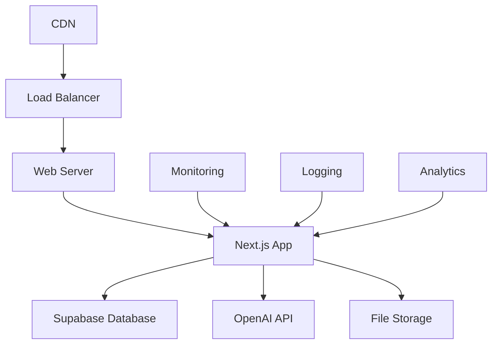

# Deployment Guide

## Table of Contents

1. [Overview](#overview)
2. [Production Environment](#production-environment)
3. [Deployment Platforms](#deployment-platforms)
4. [Environment Configuration](#environment-configuration)
5. [Database Setup](#database-setup)
6. [Performance Optimization](#performance-optimization)
7. [Monitoring and Logging](#monitoring-and-logging)
8. [Security](#security)
9. [Backup and Recovery](#backup-and-recovery)
10. [Troubleshooting](#troubleshooting)

## Overview

This guide covers the deployment of the Chatbot UI application to production environments. The application is designed to be deployed on various platforms with minimal configuration while maintaining high performance and security standards.

### Deployment Architecture



### Prerequisites

- **Domain**: Registered domain name
- **SSL Certificate**: Valid SSL certificate
- **API Keys**: OpenAI, Supabase, and other service keys
- **Monitoring**: Application monitoring setup
- **Backup Strategy**: Database and file backup plan

## Production Environment

### System Requirements

#### Minimum Requirements
- **CPU**: 2 vCPUs
- **RAM**: 4GB
- **Storage**: 20GB SSD
- **Network**: 100 Mbps

#### Recommended Requirements
- **CPU**: 4 vCPUs
- **RAM**: 8GB
- **Storage**: 50GB SSD
- **Network**: 1 Gbps

### Environment Variables

#### Required Production Variables

```env
# Application
NODE_ENV=production
NEXT_PUBLIC_APP_URL=https://your-domain.com

# Database
NEXT_PUBLIC_SUPABASE_URL=https://your-project.supabase.co
NEXT_PUBLIC_SUPABASE_ANON_KEY=your_anon_key
SUPABASE_SERVICE_ROLE_KEY=your_service_role_key

# AI Services
OPENAI_API_KEY=your_openai_api_key
ANTHROPIC_API_KEY=your_anthropic_api_key
GOOGLE_API_KEY=your_google_api_key

# File Storage and AI Processing
SUPABASE_STORAGE_BUCKET=your_bucket_name
FILE_UPLOAD_MAX_SIZE=10485760
AI_PROCESSING_ENABLED=true

# Authentication
NEXTAUTH_URL=https://your-domain.com
NEXTAUTH_SECRET=your_nextauth_secret

# File Storage
SUPABASE_STORAGE_BUCKET=your_bucket_name
```

#### Optional Production Variables

```env
# Analytics
NEXT_PUBLIC_GOOGLE_ANALYTICS_ID=your_ga_id
NEXT_PUBLIC_MIXPANEL_TOKEN=your_mixpanel_token

# Monitoring
SENTRY_DSN=your_sentry_dsn
LOGTAIL_TOKEN=your_logtail_token

# Performance
NEXT_PUBLIC_EDGE_CONFIG=your_edge_config
NEXT_PUBLIC_VERCEL_ANALYTICS_ID=your_va_id

# Security
HSTS_MAX_AGE=31536000
CSP_NONCE=your_csp_nonce
```

## Deployment Platforms

### Vercel (Recommended)

Vercel provides the best integration with Next.js applications.

#### 1. Connect Repository

```bash
# Install Vercel CLI
npm i -g vercel

# Login to Vercel
vercel login

# Deploy from repository
vercel --prod
```

#### 2. Environment Configuration

```bash
# Set environment variables
vercel env add OPENAI_API_KEY
vercel env add SUPABASE_SERVICE_ROLE_KEY
vercel env add NEXTAUTH_SECRET

# Add to production
vercel env pull .env.production.local
```

#### 3. Custom Domain

```bash
# Add custom domain
vercel domains add your-domain.com

# Configure DNS
# Add CNAME record pointing to your-vercel-app.vercel.app
```

#### 4. Vercel Configuration

```json
// vercel.json
{
  "buildCommand": "npm run build",
  "outputDirectory": ".next",
  "framework": "nextjs",
  "regions": ["iad1"],
  "functions": {
    "app/api/**/*.ts": {
      "maxDuration": 30
    }
  },
  "headers": [
    {
      "source": "/(.*)",
      "headers": [
        {
          "key": "X-Frame-Options",
          "value": "DENY"
        },
        {
          "key": "X-Content-Type-Options",
          "value": "nosniff"
        },
        {
          "key": "Referrer-Policy",
          "value": "origin-when-cross-origin"
        }
      ]
    }
  ]
}
```

### Netlify

#### 1. Build Configuration

```toml
# netlify.toml
[build]
  command = "npm run build"
  publish = ".next"

[build.environment]
  NODE_VERSION = "18"

[[redirects]]
  from = "/*"
  to = "/index.html"
  status = 200

[[headers]]
  for = "/*"
  [headers.values]
    X-Frame-Options = "DENY"
    X-Content-Type-Options = "nosniff"
    Referrer-Policy = "origin-when-cross-origin"
```

#### 2. Environment Variables

Set environment variables in Netlify dashboard:
- Go to Site settings > Environment variables
- Add all required production variables

### Railway

#### 1. Railway Configuration

```json
// railway.json
{
  "$schema": "https://railway.app/railway.schema.json",
  "build": {
    "builder": "NIXPACKS"
  },
  "deploy": {
    "startCommand": "npm start",
    "healthcheckPath": "/api/health",
    "healthcheckTimeout": 300,
    "restartPolicyType": "ON_FAILURE",
    "restartPolicyMaxRetries": 10
  }
}
```

#### 2. Environment Variables

Set environment variables in Railway dashboard:
- Go to your project
- Navigate to Variables tab
- Add all required production variables

### Docker Deployment

#### 1. Dockerfile

```dockerfile
# Dockerfile
FROM node:18-alpine AS base

# Install dependencies only when needed
FROM base AS deps
RUN apk add --no-cache libc6-compat
WORKDIR /app

# Install dependencies based on the preferred package manager
COPY package.json package-lock.json* ./
RUN npm ci --only=production

# Rebuild the source code only when needed
FROM base AS builder
WORKDIR /app
COPY --from=deps /app/node_modules ./node_modules
COPY . .

# Next.js collects completely anonymous telemetry data about general usage.
# Learn more here: https://nextjs.org/telemetry
# Uncomment the following line in case you want to disable telemetry during the build.
ENV NEXT_TELEMETRY_DISABLED 1

RUN npm run build

# Production image, copy all the files and run next
FROM base AS runner
WORKDIR /app

ENV NODE_ENV production
ENV NEXT_TELEMETRY_DISABLED 1

RUN addgroup --system --gid 1001 nodejs
RUN adduser --system --uid 1001 nextjs

COPY --from=builder /app/public ./public

# Set the correct permission for prerender cache
RUN mkdir .next
RUN chown nextjs:nodejs .next

# Automatically leverage output traces to reduce image size
# https://nextjs.org/docs/advanced-features/output-file-tracing
COPY --from=builder --chown=nextjs:nodejs /app/.next/standalone ./
COPY --from=builder --chown=nextjs:nodejs /app/.next/static ./.next/static

USER nextjs

EXPOSE 3000

ENV PORT 3000
ENV HOSTNAME "0.0.0.0"

CMD ["node", "server.js"]
```

#### 2. Docker Compose

```yaml
# docker-compose.yml
version: '3.8'

services:
  chatbot-ui:
    build: .
    ports:
      - "3000:3000"
    environment:
      - NODE_ENV=production
      - NEXT_PUBLIC_APP_URL=https://your-domain.com
    env_file:
      - .env.production
    restart: unless-stopped
    healthcheck:
      test: ["CMD", "curl", "-f", "http://localhost:3000/api/health"]
      interval: 30s
      timeout: 10s
      retries: 3

  nginx:
    image: nginx:alpine
    ports:
      - "80:80"
      - "443:443"
    volumes:
      - ./nginx.conf:/etc/nginx/nginx.conf
      - ./ssl:/etc/nginx/ssl
    depends_on:
      - chatbot-ui
    restart: unless-stopped
```

#### 3. Nginx Configuration

```nginx
# nginx.conf
events {
    worker_connections 1024;
}

http {
    upstream chatbot-ui {
        server chatbot-ui:3000;
    }

    server {
        listen 80;
        server_name your-domain.com;
        return 301 https://$server_name$request_uri;
    }

    server {
        listen 443 ssl http2;
        server_name your-domain.com;

        ssl_certificate /etc/nginx/ssl/cert.pem;
        ssl_certificate_key /etc/nginx/ssl/key.pem;

        # Security headers
        add_header X-Frame-Options "DENY" always;
        add_header X-Content-Type-Options "nosniff" always;
        add_header X-XSS-Protection "1; mode=block" always;
        add_header Referrer-Policy "origin-when-cross-origin" always;
        add_header Content-Security-Policy "default-src 'self'; script-src 'self' 'unsafe-eval' 'unsafe-inline'; style-src 'self' 'unsafe-inline';" always;

        location / {
            proxy_pass http://chatbot-ui;
            proxy_http_version 1.1;
            proxy_set_header Upgrade $http_upgrade;
            proxy_set_header Connection 'upgrade';
            proxy_set_header Host $host;
            proxy_set_header X-Real-IP $remote_addr;
            proxy_set_header X-Forwarded-For $proxy_add_x_forwarded_for;
            proxy_set_header X-Forwarded-Proto $scheme;
            proxy_cache_bypass $http_upgrade;
        }
    }
}
```

## Environment Configuration

### Production Build

```bash
# Install dependencies
npm ci --only=production

# Build application
npm run build

# Start production server
npm start
```

### Environment Validation

```typescript
// lib/env-validation.ts
import { z } from 'zod'

const envSchema = z.object({
  NODE_ENV: z.enum(['development', 'production', 'test']),
  NEXT_PUBLIC_APP_URL: z.string().url(),
  OPENAI_API_KEY: z.string().min(1),
  NEXT_PUBLIC_SUPABASE_URL: z.string().url(),
  NEXT_PUBLIC_SUPABASE_ANON_KEY: z.string().min(1),
  SUPABASE_SERVICE_ROLE_KEY: z.string().min(1),
})

export const validateEnv = () => {
  try {
    return envSchema.parse(process.env)
  } catch (error) {
    console.error('❌ Invalid environment variables:', error)
    process.exit(1)
  }
}
```

### Health Check Endpoint

```typescript
// app/api/health/route.ts
import { NextResponse } from 'next/server'
import { createClient } from '@/lib/supabase/server'

export async function GET() {
  try {
    // Check database connection
    const supabase = createClient()
    const { data, error } = await supabase.from('profiles').select('count').limit(1)
    
    if (error) {
      return NextResponse.json(
        { status: 'error', message: 'Database connection failed' },
        { status: 503 }
      )
    }

    // Check OpenAI API
    const openaiResponse = await fetch('https://api.openai.com/v1/models', {
      headers: {
        'Authorization': `Bearer ${process.env.OPENAI_API_KEY}`
      }
    })

    if (!openaiResponse.ok) {
      return NextResponse.json(
        { status: 'error', message: 'OpenAI API connection failed' },
        { status: 503 }
      )
    }

    return NextResponse.json({
      status: 'healthy',
      timestamp: new Date().toISOString(),
      version: process.env.npm_package_version || 'unknown'
    })
  } catch (error) {
    return NextResponse.json(
      { status: 'error', message: 'Health check failed' },
      { status: 503 }
    )
  }
}
```

## Database Setup

### Supabase Production Setup

#### 1. Create Production Project

1. Go to [Supabase Dashboard](https://supabase.com/dashboard)
2. Create a new project
3. Choose a region close to your users
4. Set up database password

#### 2. Run Migrations

```bash
# Link to production project
supabase link --project-ref your-project-ref

# Push migrations (includes enhanced file system)
supabase db push

# Generate types
supabase gen types typescript --project-id your-project-id > types/supabase.ts

# Verify enhanced file system migration
supabase db diff
```

#### 3. Configure RLS Policies

```sql
-- Enable RLS on all tables
ALTER TABLE profiles ENABLE ROW LEVEL SECURITY;
ALTER TABLE workspaces ENABLE ROW LEVEL SECURITY;
ALTER TABLE chats ENABLE ROW LEVEL SECURITY;
ALTER TABLE messages ENABLE ROW LEVEL SECURITY;
ALTER TABLE memories ENABLE ROW LEVEL SECURITY;

-- Create policies
CREATE POLICY "Users can view own profile" ON profiles
  FOR SELECT USING (auth.uid() = id);

CREATE POLICY "Users can update own profile" ON profiles
  FOR UPDATE USING (auth.uid() = id);
```

#### 4. Enhanced File System Setup

```bash
# Verify enhanced files table exists
supabase db diff --schema public

# Check AI processing functions
supabase db diff --schema public | grep -i "ai\|file"

# Test file upload functionality
curl -X POST https://your-domain.com/api/files/ai-upload \
  -F "files=@test.pdf" \
  -F "workspace_id=test-workspace" \
  -H "Authorization: Bearer your-token"
```

#### 5. Set Up Backups

```bash
# Enable point-in-time recovery
-- In Supabase dashboard: Settings > Database > Point-in-time recovery

# Set up automated backups
-- Configure backup schedule in Supabase dashboard

# Backup file storage
-- Configure Supabase Storage backup in dashboard
```

### Database Optimization

#### 1. Indexes

```sql
-- Performance indexes
CREATE INDEX idx_messages_chat_id ON messages(chat_id);
CREATE INDEX idx_messages_user_id ON messages(user_id);
CREATE INDEX idx_messages_created_at ON messages(created_at DESC);
CREATE INDEX idx_memories_user_id ON memories(user_id);
CREATE INDEX idx_memories_relevance ON memories(relevance_score DESC);
CREATE INDEX idx_memories_embedding ON memories USING ivfflat (embedding vector_cosine_ops);
```

#### 2. Connection Pooling

```typescript
// lib/supabase/server.ts
import { createClient } from '@supabase/supabase-js'

const supabaseUrl = process.env.NEXT_PUBLIC_SUPABASE_URL!
const supabaseServiceKey = process.env.SUPABASE_SERVICE_ROLE_KEY!

export const createClient = () => {
  return createClient(supabaseUrl, supabaseServiceKey, {
    auth: {
      autoRefreshToken: false,
      persistSession: false
    },
    db: {
      schema: 'public'
    }
  })
}
```

## Performance Optimization

### Next.js Optimization

#### 1. Build Optimization

```javascript
// next.config.js
/** @type {import('next').NextConfig} */
const nextConfig = {
  experimental: {
    optimizeCss: true,
    optimizePackageImports: ['@radix-ui/react-icons', 'lucide-react'],
  },
  images: {
    domains: ['your-domain.com'],
    formats: ['image/webp', 'image/avif'],
  },
  compress: true,
  poweredByHeader: false,
  generateEtags: false,
  compress: true,
  swcMinify: true,
}

module.exports = nextConfig
```

#### 2. Bundle Analysis

```bash
# Analyze bundle size
npm run analyze

# Check for large dependencies
npx @next/bundle-analyzer
```

#### 3. Caching Strategy

```typescript
// app/api/chat/route.ts
import { NextResponse } from 'next/server'

export async function POST(request: Request) {
  const response = NextResponse.json(data)
  
  // Cache API responses
  response.headers.set('Cache-Control', 'public, s-maxage=10, stale-while-revalidate=59')
  
  return response
}
```

### CDN Configuration

#### 1. Vercel Edge Config

```typescript
// lib/edge-config.ts
import { get } from '@vercel/edge-config'

export async function getConfig() {
  const config = await get('production')
  return config
}
```

#### 2. Static Asset Optimization

```typescript
// next.config.js
const nextConfig = {
  async headers() {
    return [
      {
        source: '/static/:path*',
        headers: [
          {
            key: 'Cache-Control',
            value: 'public, max-age=31536000, immutable',
          },
        ],
      },
    ]
  },
}
```

### File System Optimization

#### 1. File Storage Configuration

```typescript
// lib/file-storage.ts
import { createClient } from '@supabase/supabase-js'

const supabase = createClient(
  process.env.NEXT_PUBLIC_SUPABASE_URL!,
  process.env.SUPABASE_SERVICE_ROLE_KEY!
)

export const uploadFile = async (file: File, path: string) => {
  const { data, error } = await supabase.storage
    .from('files')
    .upload(path, file, {
      cacheControl: '3600',
      upsert: false
    })
  
  return { data, error }
}
```

#### 2. AI Processing Queue

```typescript
// lib/ai-processing-queue.ts
import { Queue } from 'bull'

const aiProcessingQueue = new Queue('ai-file-processing', {
  redis: process.env.REDIS_URL
})

aiProcessingQueue.process(async (job) => {
  const { fileId, content } = job.data
  
  // Process file with AI
  const metadata = await processFileWithAI(content)
  
  // Update database
  await updateFileMetadata(fileId, metadata)
})
```

#### 3. File Caching Strategy

```typescript
// lib/file-cache.ts
import { LRUCache } from 'lru-cache'

const fileMetadataCache = new LRUCache<string, any>({
  max: 500,
  ttl: 1000 * 60 * 30, // 30 minutes
})

export const getCachedFileMetadata = async (fileId: string) => {
  if (fileMetadataCache.has(fileId)) {
    return fileMetadataCache.get(fileId)
  }
  
  const metadata = await fetchFileMetadata(fileId)
  fileMetadataCache.set(fileId, metadata)
  return metadata
}
```

### Memory System Optimization

#### 1. Embedding Caching

```typescript
// lib/memory-cache.ts
import { LRUCache } from 'lru-cache'

const embeddingCache = new LRUCache<string, number[]>({
  max: 1000,
  ttl: 1000 * 60 * 60, // 1 hour
})

export const getCachedEmbedding = async (text: string): Promise<number[]> => {
  const hash = createHash(text)
  
  if (embeddingCache.has(hash)) {
    return embeddingCache.get(hash)!
  }
  
  const embedding = await generateEmbedding(text)
  embeddingCache.set(hash, embedding)
  return embedding
}
```

#### 2. Batch Processing

```typescript
// lib/memory-batch.ts
export const processMemoriesBatch = async (
  memories: Array<{ content: string; user_id: string }>
): Promise<Memory[]> => {
  const batchSize = 10
  const results: Memory[] = []
  
  for (let i = 0; i < memories.length; i += batchSize) {
    const batch = memories.slice(i, i + batchSize)
    const batchResults = await Promise.all(
      batch.map(memory => saveEnhancedMemory(supabase, memory.content, memory.user_id))
    )
    results.push(...batchResults)
  }
  
  return results
}
```

## Monitoring and Logging

### Application Monitoring

#### 1. Sentry Integration

```typescript
// lib/sentry.ts
import * as Sentry from '@sentry/nextjs'

Sentry.init({
  dsn: process.env.SENTRY_DSN,
  environment: process.env.NODE_ENV,
  tracesSampleRate: 1.0,
  integrations: [
    new Sentry.BrowserTracing({
      tracePropagationTargets: ['localhost', 'your-domain.com'],
    }),
  ],
})

export { Sentry }
```

#### 2. Performance Monitoring

```typescript
// lib/performance.ts
import { getCLS, getFID, getFCP, getLCP, getTTFB } from 'web-vitals'

export function reportWebVitals(metric: any) {
  // Send to analytics
  console.log(metric)
  
  // Send to monitoring service
  if (process.env.NODE_ENV === 'production') {
    Sentry.captureMessage('Web Vital', {
      level: 'info',
      extra: metric,
    })
  }
}

// Initialize web vitals
getCLS(reportWebVitals)
getFID(reportWebVitals)
getFCP(reportWebVitals)
getLCP(reportWebVitals)
getTTFB(reportWebVitals)
```

### Logging

#### 1. Structured Logging

```typescript
// lib/logger.ts
import pino from 'pino'

export const logger = pino({
  level: process.env.LOG_LEVEL || 'info',
  transport: {
    target: 'pino-pretty',
    options: {
      colorize: true,
    },
  },
})

export const logError = (error: Error, context?: any) => {
  logger.error({
    error: error.message,
    stack: error.stack,
    context,
  })
}
```

#### 2. API Logging

```typescript
// middleware.ts
import { NextResponse } from 'next/server'
import type { NextRequest } from 'next/server'
import { logger } from '@/lib/logger'

export function middleware(request: NextRequest) {
  const start = Date.now()
  
  const response = NextResponse.next()
  
  response.headers.set('x-response-time', `${Date.now() - start}ms`)
  
  logger.info({
    method: request.method,
    url: request.url,
    userAgent: request.headers.get('user-agent'),
    responseTime: Date.now() - start,
  })
  
  return response
}
```

### Health Checks

#### 1. Application Health

```typescript
// app/api/health/route.ts
export async function GET() {
  const checks = {
    database: await checkDatabase(),
    openai: await checkOpenAI(),
    memory: await checkMemorySystem(),
  }
  
  const isHealthy = Object.values(checks).every(check => check.status === 'healthy')
  
  return NextResponse.json({
    status: isHealthy ? 'healthy' : 'unhealthy',
    checks,
    timestamp: new Date().toISOString(),
  }, {
    status: isHealthy ? 200 : 503,
  })
}
```

#### 2. Database Health

```typescript
async function checkDatabase() {
  try {
    const supabase = createClient()
    const { data, error } = await supabase
      .from('profiles')
      .select('count')
      .limit(1)
    
    if (error) {
      return { status: 'unhealthy', error: error.message }
    }
    
    return { status: 'healthy' }
  } catch (error) {
    return { status: 'unhealthy', error: error.message }
  }
}
```

## Security

### Security Headers

```typescript
// next.config.js
const securityHeaders = [
  {
    key: 'X-DNS-Prefetch-Control',
    value: 'on'
  },
  {
    key: 'Strict-Transport-Security',
    value: 'max-age=63072000; includeSubDomains; preload'
  },
  {
    key: 'X-XSS-Protection',
    value: '1; mode=block'
  },
  {
    key: 'X-Frame-Options',
    value: 'SAMEORIGIN'
  },
  {
    key: 'X-Content-Type-Options',
    value: 'nosniff'
  },
  {
    key: 'Referrer-Policy',
    value: 'origin-when-cross-origin'
  },
  {
    key: 'Content-Security-Policy',
    value: "default-src 'self'; script-src 'self' 'unsafe-eval' 'unsafe-inline'; style-src 'self' 'unsafe-inline'; img-src 'self' data: https:; font-src 'self' data:; connect-src 'self' https://api.openai.com https://*.supabase.co;"
  }
]

module.exports = {
  async headers() {
    return [
      {
        source: '/(.*)',
        headers: securityHeaders,
      },
    ]
  },
}
```

### API Rate Limiting

```typescript
// lib/rate-limit.ts
import { LRUCache } from 'lru-cache'

const rateLimit = new LRUCache({
  max: 1000,
  ttl: 1000 * 60 * 15, // 15 minutes
})

export function checkRateLimit(identifier: string, limit: number = 100) {
  const current = rateLimit.get(identifier) as number || 0
  
  if (current >= limit) {
    return false
  }
  
  rateLimit.set(identifier, current + 1)
  return true
}
```

### Input Validation

```typescript
// lib/validation.ts
import { z } from 'zod'

export const messageSchema = z.object({
  content: z.string().min(1).max(10000),
  model: z.string().optional(),
  temperature: z.number().min(0).max(2).optional(),
})

export const memorySchema = z.object({
  content: z.string().min(1).max(8192),
  user_id: z.string().uuid(),
})
```

## Backup and Recovery

### Database Backup

#### 1. Automated Backups

```bash
# Supabase automated backups
# Configure in Supabase dashboard: Settings > Database > Backups

# Manual backup
pg_dump $DATABASE_URL > backup_$(date +%Y%m%d_%H%M%S).sql
```

#### 2. File Storage Backup

```typescript
// scripts/backup-files.ts
import { createClient } from '@/lib/supabase/server'

export async function backupFiles() {
  const supabase = createClient()
  
  const { data: files } = await supabase
    .storage
    .from('files')
    .list()
  
  // Download and store files
  for (const file of files) {
    const { data } = await supabase
      .storage
      .from('files')
      .download(file.name)
    
    // Save to backup location
    await saveToBackup(data, file.name)
  }
}
```

### Recovery Procedures

#### 1. Database Recovery

```bash
# Restore from backup
psql $DATABASE_URL < backup_20241201_120000.sql

# Point-in-time recovery (Supabase)
# Use Supabase dashboard to restore to specific point in time
```

#### 2. Application Recovery

```bash
# Rollback to previous deployment
vercel rollback

# Restore from backup
npm run db-restore
npm run files-restore
```

## Troubleshooting

### Common Issues

#### 1. Build Failures

**Problem**: Build failing in production
**Solutions**:
```bash
# Check for missing dependencies
npm ci --only=production

# Clear build cache
rm -rf .next
npm run build

# Check environment variables
npm run validate-env
```

#### 2. Database Connection Issues

**Problem**: Cannot connect to Supabase
**Solutions**:
```bash
# Check Supabase status
curl https://status.supabase.com/api/v2/status.json

# Verify connection
supabase status

# Check environment variables
echo $NEXT_PUBLIC_SUPABASE_URL
echo $SUPABASE_SERVICE_ROLE_KEY
```

#### 3. Memory System Issues

**Problem**: Memory operations failing
**Solutions**:
```bash
# Check OpenAI API
curl -H "Authorization: Bearer $OPENAI_API_KEY" https://api.openai.com/v1/models

# Test memory system
npm run test:memory

# Check logs
tail -f logs/memory.log
```

#### 4. Performance Issues

**Problem**: Slow response times
**Solutions**:
```bash
# Check database performance
supabase db analyze

# Monitor API calls
npm run monitor

# Optimize images
npm run optimize-images
```

### Debug Tools

#### 1. Production Debugging

```typescript
// Enable debug mode
DEBUG=* npm start

// Check memory usage
node --inspect npm start
```

#### 2. Database Debugging

```bash
# Connect to production database
supabase db connect

# Check slow queries
SELECT query, mean_time, calls FROM pg_stat_statements ORDER BY mean_time DESC LIMIT 10;
```

#### 3. Network Debugging

```bash
# Check DNS resolution
nslookup your-domain.com

# Test SSL certificate
openssl s_client -connect your-domain.com:443 -servername your-domain.com

# Check response times
curl -w "@curl-format.txt" -o /dev/null -s "https://your-domain.com"
```

### Emergency Procedures

#### 1. Rollback Deployment

```bash
# Vercel rollback
vercel rollback

# Docker rollback
docker-compose down
docker-compose up -d chatbot-ui:previous-version
```

#### 2. Database Emergency

```bash
# Emergency database restore
supabase db reset --linked

# Point-in-time recovery
# Use Supabase dashboard emergency recovery
```

#### 3. Service Recovery

```bash
# Restart services
docker-compose restart

# Check service health
docker-compose ps
docker-compose logs chatbot-ui
```

---

**Last Updated**: December 2024  
**Version**: 2.0.0  
**Status**: Complete
