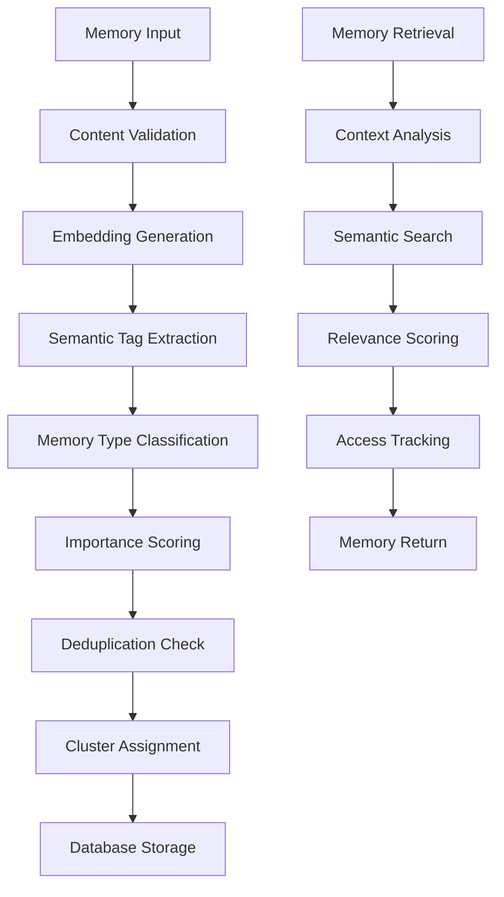

# Memory System Documentation

## Table of Contents

1. [Overview](#overview)
2. [Architecture](#architecture)
3. [Core Components](#core-components)
4. [Memory Types](#memory-types)
5. [API Endpoints](#api-endpoints)
6. [Configuration](#configuration)
7. [Usage Examples](#usage-examples)
8. [Performance Optimization](#performance-optimization)
9. [Troubleshooting](#troubleshooting)

## Overview

The Chatbot UI Memory System is an intelligent, semantic-based memory management system that enables AI assistants to remember and recall relevant information from previous conversations. It uses advanced NLP techniques including embeddings, semantic clustering, and relevance scoring to provide contextually appropriate memory retrieval.

### Key Features

- **Semantic Memory Storage**: Stores memories with vector embeddings for semantic search
- **Intelligent Clustering**: Automatically groups related memories into clusters
- **Relevance Scoring**: Calculates importance and relevance scores for memories
- **Deduplication**: Prevents duplicate memories using semantic similarity
- **Memory Types**: Categorizes memories into different types (personal, technical, preference, etc.)
- **Access Tracking**: Monitors memory access patterns for optimization
- **Decay Mechanism**: Implements relevance decay over time

## Architecture

### System Components



### Data Flow

1. **Memory Creation**:
   - Content validation and sanitization
   - OpenAI embedding generation
   - Semantic tag extraction using GPT-4
   - Memory type classification
   - Importance score calculation
   - Duplicate detection
   - Cluster assignment or creation

2. **Memory Retrieval**:
   - Context embedding generation
   - Semantic similarity search
   - Relevance score calculation
   - Access pattern tracking
   - Memory ranking and filtering

## Core Components

### 1. Memory System (`lib/memory-system.ts`)

The main memory system implementation containing core functions:

#### Key Functions

- `generateEmbedding(text: string)`: Creates vector embeddings using OpenAI
- `extractSemanticTags(content: string)`: Extracts semantic tags using GPT-4
- `determineMemoryType(content: string)`: Classifies memory type
- `calculateImportanceScore(content: string, memoryType: string)`: Calculates importance
- `saveEnhancedMemory(supabase, content, user_id)`: Saves memory with full processing
- `getRelevantMemories(supabase, user_id, context, limit)`: Retrieves relevant memories

#### Memory Types

```typescript
type MemoryType = 'personal' | 'preference' | 'technical' | 'project' | 'general'
```

#### Memory Interface

```typescript
interface Memory {
  id: string
  content: string
  user_id: string
  created_at: string
  embedding?: number[]
  cluster_id?: string
  relevance_score: number
  access_count: number
  last_accessed: string
  semantic_tags: string[]
  memory_type: string
  importance_score: number
}
```

### 2. Memory Deduplication (`lib/memory-deduplication.ts`)

Prevents duplicate memories using semantic similarity:

```typescript
export const checkForDuplicates = async (
  content: string,
  user_id: string,
  similarityThreshold: number = 0.8
): Promise<boolean>
```

### 3. Memory Validation (`lib/memory-validation.ts`)

Validates memory content and prevents AI responses:

```typescript
export const validateMemoryContent = (content: string): boolean
export const isAIResponse = (content: string): boolean
```

### 4. Memory Optimization (`lib/memory-optimization.ts`)

Handles memory optimization and cleanup:

```typescript
export const optimizeMemories = async (supabase: any, user_id: string)
export const decayMemoryRelevance = async (supabase: any)
```

## Memory Types

### 1. Personal (`personal`)
- **Description**: Personal information about the user
- **Keywords**: name, work, job, location, family
- **Importance Boost**: +0.2
- **Examples**: "My name is John", "I work at Google"

### 2. Preference (`preference`)
- **Description**: User preferences and likes/dislikes
- **Keywords**: prefer, like, dislike, favorite, hate
- **Importance Boost**: +0.15
- **Examples**: "I prefer dark mode", "I don't like spicy food"

### 3. Technical (`technical`)
- **Description**: Technical information and code
- **Keywords**: code, programming, function, API, database
- **Importance Boost**: +0.1
- **Examples**: "I use React for frontend", "My database is PostgreSQL"

### 4. Project (`project`)
- **Description**: Project-related information
- **Keywords**: project, task, goal, deadline, milestone
- **Importance Boost**: +0.05
- **Examples**: "Working on chatbot UI", "Deadline is next Friday"

### 5. General (`general`)
- **Description**: General information not fitting other categories
- **Keywords**: None specific
- **Importance Boost**: 0
- **Examples**: "I enjoy reading", "The weather is nice"

## API Endpoints

### Memory Management

#### POST `/api/memory/save`
Save a new memory with full processing.

**Request Body**:
```json
{
  "content": "string",
  "user_id": "string"
}
```

**Response**:
```json
{
  "id": "string",
  "content": "string",
  "memory_type": "string",
  "importance_score": "number",
  "semantic_tags": ["string"],
  "cluster_id": "string"
}
```

#### GET `/api/memory/list`
Retrieve all memories for a user.

**Query Parameters**:
- `user_id`: User ID
- `limit`: Number of memories to return (default: 50)
- `offset`: Pagination offset (default: 0)
- `type`: Filter by memory type
- `cluster_id`: Filter by cluster ID

#### GET `/api/memory/retrieve`
Retrieve relevant memories based on context.

**Query Parameters**:
- `user_id`: User ID
- `context`: Current conversation context
- `limit`: Number of memories to return (default: 5)
- `similarity_threshold`: Minimum similarity score (default: 0.6)

### Memory Clusters

#### GET `/api/memory/clusters`
Get all memory clusters for a user.

#### GET `/api/memory/cluster/[clusterId]`
Get memories in a specific cluster.

#### POST `/api/memory/cluster/[clusterId]`
Update cluster information.

### Memory Operations

#### DELETE `/api/memory/delete/[memoryId]`
Delete a specific memory.

#### GET `/api/memory/stats`
Get memory statistics for a user.

#### POST `/api/memory/optimize`
Optimize memories (cleanup, deduplication).

#### POST `/api/memory/regenerate-embeddings`
Regenerate embeddings for all memories.

## Configuration

### Environment Variables

```env
# OpenAI Configuration
OPENAI_API_KEY=your_openai_api_key

# Memory System Configuration
MEMORY_SIMILARITY_THRESHOLD=0.8
MEMORY_MAX_LENGTH=8192
MEMORY_DEFAULT_LIMIT=5
MEMORY_DECAY_RATE=0.1
```

### Memory System Settings

```typescript
interface MemoryConfig {
  similarityThreshold: number        // Default: 0.8
  maxContentLength: number          // Default: 8192
  defaultRetrievalLimit: number     // Default: 5
  decayRate: number                 // Default: 0.1
  embeddingModel: string            // Default: "text-embedding-3-small"
  tagExtractionModel: string        // Default: "gpt-4-turbo-preview"
}
```

## Usage Examples

### Basic Memory Operations

#### 1. Save a Memory

```typescript
import { saveEnhancedMemory } from '@/lib/memory-system'

const memory = await saveEnhancedMemory(
  supabaseClient,
  "I prefer using TypeScript for my projects",
  "user-123"
)

console.log(memory)
// {
//   id: "mem-456",
//   content: "I prefer using TypeScript for my projects",
//   memory_type: "preference",
//   importance_score: 0.65,
//   semantic_tags: ["typescript", "preference", "programming"],
//   cluster_id: "cluster-789"
// }
```

#### 2. Retrieve Relevant Memories

```typescript
import { getRelevantMemories } from '@/lib/memory-system'

const relevantMemories = await getRelevantMemories(
  supabaseClient,
  "user-123",
  "What programming languages do you know?",
  5,
  0.6
)

console.log(relevantMemories)
// [
//   {
//     id: "mem-456",
//     content: "I prefer using TypeScript for my projects",
//     relevance_score: 0.85,
//     similarity: 0.92
//   }
// ]
```

#### 3. Get Memory Clusters

```typescript
import { getMemoryClusters } from '@/lib/memory-system'

const clusters = await getMemoryClusters(supabaseClient, "user-123")

console.log(clusters)
// [
//   {
//     id: "cluster-789",
//     name: "Programming Preferences",
//     description: "User's programming language preferences",
//     memory_count: 3,
//     average_relevance_score: 0.75
//   }
// ]
```

### Advanced Usage

#### 1. Custom Memory Processing

```typescript
import { 
  generateEmbedding, 
  extractSemanticTags, 
  determineMemoryType,
  calculateImportanceScore 
} from '@/lib/memory-system'

// Custom memory processing
const embedding = await generateEmbedding(content)
const tags = await extractSemanticTags(content)
const type = determineMemoryType(content)
const importance = calculateImportanceScore(content, type)

// Custom database insertion
const { data, error } = await supabase
  .from('memories')
  .insert({
    content,
    user_id,
    embedding,
    semantic_tags: tags,
    memory_type: type,
    importance_score: importance
  })
```

#### 2. Memory Optimization

```typescript
import { optimizeMemories } from '@/lib/memory-optimization'

// Run memory optimization
await optimizeMemories(supabaseClient, "user-123")

// This will:
// - Remove duplicate memories
// - Update relevance scores
// - Reorganize clusters
// - Clean up old memories
```

## Performance Optimization

### 1. Embedding Caching

```typescript
// Cache embeddings to avoid regeneration
const embeddingCache = new Map<string, number[]>()

export const getCachedEmbedding = async (text: string): Promise<number[]> => {
  const hash = createHash(text)
  if (embeddingCache.has(hash)) {
    return embeddingCache.get(hash)!
  }
  
  const embedding = await generateEmbedding(text)
  embeddingCache.set(hash, embedding)
  return embedding
}
```

### 2. Batch Processing

```typescript
// Process multiple memories in batches
export const saveMemoriesBatch = async (
  supabase: any,
  memories: Array<{ content: string, user_id: string }>
): Promise<Memory[]> => {
  const batchSize = 10
  const results: Memory[] = []
  
  for (let i = 0; i < memories.length; i += batchSize) {
    const batch = memories.slice(i, i + batchSize)
    const batchResults = await Promise.all(
      batch.map(memory => saveEnhancedMemory(supabase, memory.content, memory.user_id))
    )
    results.push(...batchResults)
  }
  
  return results
}
```

### 3. Index Optimization

```sql
-- Create indexes for better performance
CREATE INDEX idx_memories_user_id ON memories(user_id);
CREATE INDEX idx_memories_type ON memories(memory_type);
CREATE INDEX idx_memories_relevance ON memories(relevance_score DESC);
CREATE INDEX idx_memories_created_at ON memories(created_at DESC);
```

## Troubleshooting

### Common Issues

#### 1. Memory Save Failures

**Problem**: Memory save operations failing
**Solutions**:
- Check OpenAI API key configuration
- Verify content length (max 8192 characters)
- Ensure content is not an AI response
- Check for duplicate content

#### 2. Poor Memory Retrieval

**Problem**: Irrelevant memories being retrieved
**Solutions**:
- Adjust similarity threshold (default: 0.6)
- Improve context description
- Check embedding quality
- Review memory clustering

#### 3. Performance Issues

**Problem**: Slow memory operations
**Solutions**:
- Implement embedding caching
- Use batch processing
- Optimize database indexes
- Reduce embedding model complexity

#### 4. Memory Duplication

**Problem**: Duplicate memories being saved
**Solutions**:
- Check deduplication threshold (default: 0.8)
- Review content preprocessing
- Verify semantic similarity calculation
- Run memory optimization

### Debug Tools

#### 1. Memory Debug Endpoint

```typescript
// GET /api/memory/debug
// Returns detailed memory system information
const debugInfo = await fetch('/api/memory/debug')
```

#### 2. Memory Validation

```typescript
import { validateMemoryContent, isAIResponse } from '@/lib/memory-validation'

// Validate memory content
const isValid = validateMemoryContent(content)
const isAI = isAIResponse(content)
```

#### 3. Memory Statistics

```typescript
import { getMemoryStats } from '@/lib/memory-system'

// Get comprehensive memory statistics
const stats = await getMemoryStats(supabaseClient, "user-123")
console.log(stats)
// {
//   totalMemories: 150,
//   totalClusters: 12,
//   avgRelevanceScore: 0.72,
//   typeDistribution: { personal: 25, preference: 30, technical: 45 }
// }
```

### Error Handling

```typescript
try {
  const memory = await saveEnhancedMemory(supabase, content, user_id)
} catch (error) {
  if (error.message === "Duplicate memory detected") {
    console.log("Memory already exists")
  } else if (error.message === "Memory content validation failed") {
    console.log("Invalid memory content")
  } else {
    console.error("Memory save error:", error)
  }
}
```

---

**Last Updated**: December 2024  
**Version**: 2.0.0  
**Status**: Complete
