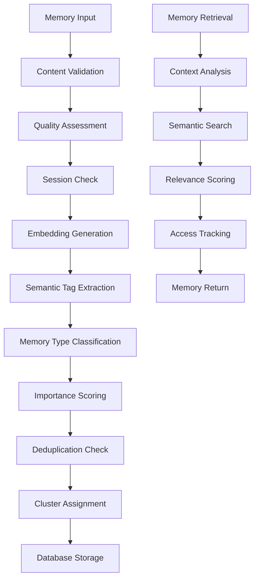

# Memory System Documentation

## Table of Contents

1. [Overview](#overview)
2. [Architecture](#architecture)
3. [Core Components](#core-components)
4. [Memory Types](#memory-types)
5. [API Endpoints](#api-endpoints)
6. [Configuration](#configuration)
7. [Usage Examples](#usage-examples)
8. [Performance Optimization](#performance-optimization)
9. [Troubleshooting](#troubleshooting)
10. [Recent Improvements](#recent-improvements)

## Overview

The Chatbot UI Memory System is an intelligent, semantic-based memory management system that enables AI assistants to remember and recall relevant information from previous conversations. It uses advanced NLP techniques including embeddings, semantic clustering, and relevance scoring to provide contextually appropriate memory retrieval.

### Key Features

- **Semantic Memory Storage**: Stores memories with vector embeddings for semantic search
- **Intelligent Clustering**: Automatically groups related memories into clusters
- **Relevance Scoring**: Calculates importance and relevance scores for memories
- **Deduplication**: Prevents duplicate memories using semantic similarity
- **Memory Types**: Categorizes memories into different types (personal, technical, preference, etc.)
- **Access Tracking**: Monitors memory access patterns for optimization
- **Decay Mechanism**: Implements relevance decay over time
- **Quality Assessment**: Evaluates memory quality before storage
- **Session Management**: Prevents duplicate processing within sessions
- **Context-Aware Processing**: Uses conversation context for better memory extraction

## Recent Improvements

### Version 2.1.0 - Efficiency and Quality Enhancements

#### 1. **Improved Session Management**
- Replaced simple in-memory cache with robust session manager
- Added TTL (Time To Live) for session data
- Automatic cleanup of expired sessions
- Better handling of serverless environments

#### 2. **Enhanced Memory Quality Scoring**
- Multi-factor quality assessment
- Content length analysis
- Personal information detection
- Preference and project information recognition
- Question filtering
- Context relevance scoring

#### 3. **Conversation-Level Processing**
- Intelligent conversation analysis
- Topic extraction
- User engagement calculation
- Question-answer pattern detection
- Priority-based processing

#### 4. **Performance Optimizations**
- Early validation and filtering
- Reduced duplicate processing
- Optimized embedding generation
- Better error handling and recovery
- Improved caching strategies

#### 5. **Vercel Deployment Optimizations**
- Updated function timeouts
- Better memory allocation
- Improved error handling for serverless environment
- Enhanced logging and monitoring

## Architecture

### System Components



### Data Flow

1. **Memory Creation**:
   - Content validation and sanitization
   - Quality assessment and scoring
   - Session duplicate check
   - OpenAI embedding generation
   - Semantic tag extraction using GPT-4
   - Memory type classification
   - Importance score calculation
   - Duplicate detection
   - Cluster assignment or creation

2. **Memory Retrieval**:
   - Context embedding generation
   - Semantic similarity search
   - Relevance score calculation
   - Access pattern tracking
   - Memory ranking and filtering

## Core Components

### 1. Memory System (`lib/memory-system.ts`)

The main memory system implementation containing core functions:

#### Key Functions

- `generateEmbedding(text: string)`: Creates vector embeddings using OpenAI
- `extractSemanticTags(content: string)`: Extracts semantic tags using GPT-4
- `determineMemoryType(content: string)`: Classifies memory type
- `calculateImportanceScore(content: string, memoryType: string)`: Calculates importance
- `saveEnhancedMemory(supabase, content, user_id, context)`: Saves memory with full processing
- `getRelevantMemories(supabase, user_id, context, limit)`: Retrieves relevant memories

#### Session Manager

```typescript
class SessionManager {
  hasProcessed(userId: string, content: string): boolean
  markProcessed(userId: string, content: string): void
  getSessionStats(): { totalSessions: number; totalContent: number }
}
```

#### Memory Quality Assessment

```typescript
const calculateMemoryQuality = (content: string, context: string = ""): number => {
  // Multi-factor scoring based on:
  // - Personal information detection
  // - Preference recognition
  // - Project information
  // - Question filtering
  // - Content length
  // - Context relevance
}
```

### 2. Intelligent Memory System (`lib/intelligent-memory-system.ts`)

Advanced conversation analysis and memory extraction:

#### Conversation Analyzer

```typescript
class ConversationAnalyzer {
  async analyzeConversation(messages: any[]): Promise<{
    hasPersonalInfo: boolean
    hasPreferences: boolean
    hasProjectInfo: boolean
    isQuestionAnswer: boolean
    conversationLength: number
    userEngagement: number
    topics: string[]
  }>
}
```

#### Memory Candidate Extractor

```typescript
class MemoryCandidateExtractor {
  async extractMemoryCandidates(
    messages: any[],
    context: any,
    priority: string
  ): Promise<MemoryCandidate[]>
}
```

### 3. Memory Interface (`lib/memory-interface.ts`)

Unified interface for memory operations:

#### Key Functions

- `saveMemoryUnified(supabase, options)`: Unified memory saving with context
- `saveMemoriesBatch(supabase, memories)`: Batch memory processing
- `assessMemoryQuality(content, context)`: Quality assessment
- `optimizeMemorySystem(user_id)`: System optimization
- `getMemoryStats(user_id)`: Statistics retrieval

### 4. Memory Validation (`lib/memory-validation.ts`)

Validates memory content and prevents AI responses:

```typescript
export const validateMemoryContent = (content: string, validationLevel: "strict" | "normal" | "lenient"): boolean
export const isAIResponse = (content: string): boolean
export const hasUserContent = (content: string): boolean
```

### 5. Memory Deduplication (`lib/memory-deduplication.ts`)

Prevents duplicate memories using semantic similarity:

```typescript
export const checkForDuplicates = async (
  content: string,
  user_id: string,
  similarityThreshold: number = 0.8
): Promise<boolean>
```

## Memory Types

```typescript
type MemoryType = 
  | "personal"           // Personal information (name, job, location)
  | "preference"         // Likes, dislikes, preferences
  | "technical"          // Technical skills, tools, frameworks
  | "project"            // Project goals, deadlines, milestones
  | "conversation_context" // General conversation context
  | "goal"               // Personal or professional goals
  | "experience"         // Past experiences, achievements
```

## API Endpoints

### Memory Save
```typescript
POST /api/memory/save
{
  "content": "string",
  "user_id": "string"
}
```

### Memory List
```typescript
GET /api/memory/list?user_id=string
```

### Memory Optimization
```typescript
POST /api/memory/optimize
{
  "action": "full_optimization" | "prune_memories" | "consolidate_memories",
  "options": {}
}
```

### Memory Cleanup
```typescript
POST /api/memory/cleanup
{
  "action": "comprehensive",
  "options": {}
}
```

## Configuration

### Intelligent Memory Configuration

```typescript
export const INTELLIGENT_MEMORY_CONFIG = {
  // Extraction thresholds
  highConfidenceThreshold: 0.85,
  mediumConfidenceThreshold: 0.7,
  lowConfidenceThreshold: 0.5,

  // Processing limits
  maxMemoriesPerConversation: 3,
  maxProcessingTimeMs: 2000,
  batchSize: 5,

  // Quality thresholds
  minQualityScore: 0.3,
  minContentLength: 10,
  maxContentLength: 1000,

  // Caching
  enableMemoryCache: true,
  cacheExpiryMs: 5 * 60 * 1000, // 5 minutes
}
```

## Usage Examples

### Basic Memory Save

```typescript
import { saveMemoryUnified } from '@/lib/memory-interface'

const memory = await saveMemoryUnified(supabase, {
  content: "My name is John and I work as a software engineer",
  user_id: "user-123",
  source: "user",
  context: { topics: ["personal", "work"] }
})
```

### Quality Assessment

```typescript
import { assessMemoryQuality } from '@/lib/memory-interface'

const assessment = assessMemoryQuality(
  "I love working with React and TypeScript",
  "technology discussion"
)

console.log(assessment)
// {
//   score: 0.8,
//   reasons: ["Contains preferences", "Contextually relevant"],
//   recommendation: "save"
// }
```

### Batch Processing

```typescript
import { saveMemoriesBatch } from '@/lib/memory-interface'

const memories = [
  { content: "I work at Google", user_id: "user-123", source: "user" },
  { content: "I prefer Python over JavaScript", user_id: "user-123", source: "user" }
]

const { results, errors } = await saveMemoriesBatch(supabase, memories)
```

## Performance Optimization

### 1. Session Management

```typescript
// Automatic cleanup every 5 minutes
const sessionManager = new SessionManager()
sessionManager.startCleanup()

// TTL-based session expiration
const TTL = 30 * 60 * 1000 // 30 minutes
```

### 2. Quality-Based Filtering

```typescript
// Early quality assessment
const qualityScore = calculateMemoryQuality(content, context)
if (qualityScore < 0.2) {
  throw new Error("Content quality too low")
}
```

### 3. Conversation Analysis

```typescript
// Intelligent processing priority
const priority = determineProcessingPriority(context, messages)
if (priority === "skip") {
  return { shouldProcess: false, candidates: [] }
}
```

### 4. Embedding Caching

```typescript
// Cache embeddings to avoid regeneration
const embeddingCache = new Map<string, number[]>()

export const getCachedEmbedding = async (text: string): Promise<number[]> => {
  const hash = createHash(text)
  if (embeddingCache.has(hash)) {
    return embeddingCache.get(hash)!
  }
  
  const embedding = await generateEmbedding(text)
  embeddingCache.set(hash, embedding)
  return embedding
}
```

## Troubleshooting

### Common Issues

#### 1. Memory Save Failures

**Problem**: Memory save operations failing
**Solutions**:
- Check OpenAI API key configuration
- Verify content length (max 1000 characters)
- Ensure content is not an AI response
- Check for duplicate content
- Review quality score thresholds

#### 2. Poor Memory Retrieval

**Problem**: Irrelevant memories being retrieved
**Solutions**:
- Adjust similarity threshold (default: 0.6)
- Improve context description
- Check embedding quality
- Review memory clustering
- Verify memory quality scores

#### 3. Performance Issues

**Problem**: Slow memory operations
**Solutions**:
- Check session cache efficiency
- Review quality assessment thresholds
- Optimize conversation analysis
- Monitor processing times
- Check for memory leaks

#### 4. Session Management Issues

**Problem**: Duplicate processing in sessions
**Solutions**:
- Check session TTL settings
- Verify session cleanup intervals
- Monitor session statistics
- Review session cache implementation

### Debug Tools

#### 1. Memory Debug Endpoint

```typescript
// GET /api/memory/debug
// Returns detailed memory system information
const debugInfo = await fetch('/api/memory/debug')
```

#### 2. Quality Assessment

```typescript
import { assessMemoryQuality } from '@/lib/memory-interface'

const assessment = assessMemoryQuality(content, context)
console.log('Memory quality:', assessment)
```

#### 3. Session Statistics

```typescript
import { sessionManager } from '@/lib/memory-system'

const stats = sessionManager.getSessionStats()
console.log('Session stats:', stats)
```

#### 4. Memory Statistics

```typescript
import { getMemoryStats } from '@/lib/interface'

const stats = await getMemoryStats(userId)
console.log('Memory stats:', stats)
```

### Error Handling

```typescript
try {
  const memory = await saveMemoryUnified(supabase, options)
} catch (error) {
  if (error.message === "Duplicate memory detected") {
    console.log("Memory already exists")
  } else if (error.message === "Memory content validation failed") {
    console.log("Invalid memory content")
  } else if (error.message === "Content quality too low") {
    console.log("Content quality below threshold")
  } else {
    console.error("Memory save error:", error)
  }
}
```

## Vercel Deployment

### Configuration

```json
{
  "functions": {
    "app/api/chat/openai/route.ts": {
      "maxDuration": 30
    },
    "app/api/memory/save/route.ts": {
      "maxDuration": 15
    },
    "app/api/memory/optimize/route.ts": {
      "maxDuration": 60
    },
    "app/api/memory/cleanup/route.ts": {
      "maxDuration": 60
    }
  }
}
```

### Environment Variables

```bash
# Required
OPENAI_API_KEY=your_openai_api_key_here

# Optional (for full memory functionality)
NEXT_PUBLIC_SUPABASE_URL=your_supabase_url
NEXT_PUBLIC_SUPABASE_ANON_KEY=your_supabase_anon_key
SUPABASE_SERVICE_ROLE_KEY=your_supabase_service_role_key
```

### Performance Monitoring

- Monitor function execution times
- Check for cold starts
- Track error rates
- Monitor memory usage
- Review session statistics

---

**Last Updated**: December 2024  
**Version**: 2.1.0  
**Status**: Complete with Efficiency Improvements
